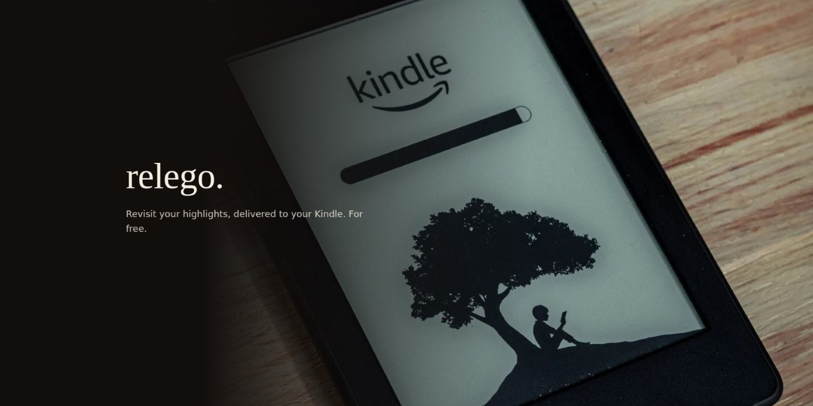
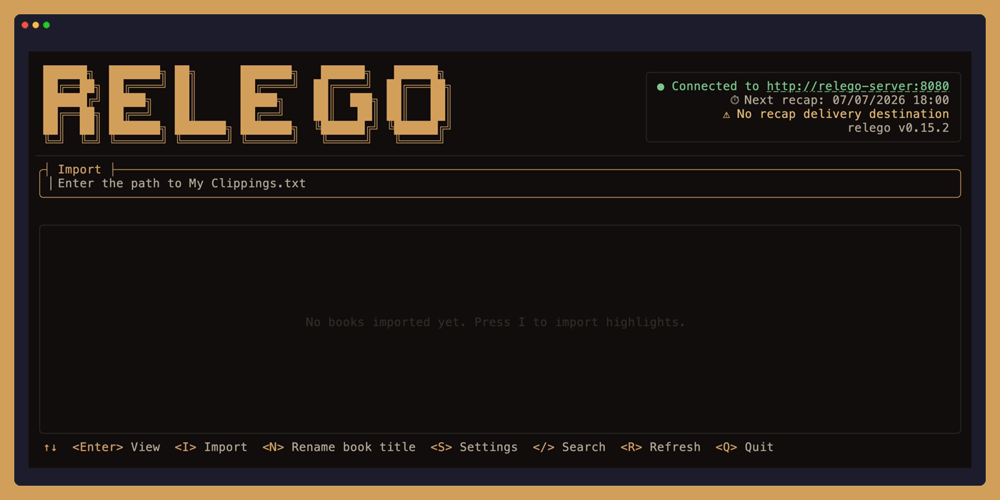
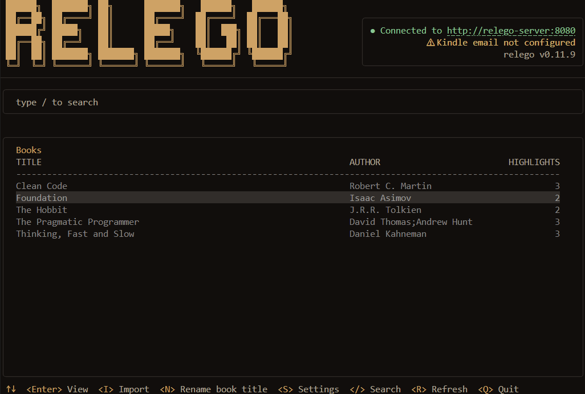

<h1 align="center">relego.</h1>

<p align="center">
  Revisit your highlights, delivered to your Kindle. For free.
</p>

[](https://opensource.org/licenses/MIT)
[](https://github.com/Krusty93/relego/actions/workflows/release.yaml)
[](https://github.com/krusty93/relego/actions/workflows/github-code-scanning/codeql)
[](https://scorecard.dev/viewer/?uri=github.com/krusty93/relego)
[](https://github.com/krusty93/relego/releases)

## Why relego.

Relego comes from the Latin *relegere*: to read again, go over carefully, review. That is the core idea of the project: bring your highlights back to Kindle so they can be revisited, not forgotten.

Capabilities:

- **E-ink first**: recaps delivered as native Kindle documents, not push notifications on your phone
- **Free and self-hosted**: no subscription, no data leaving your infrastructure
- **No lock-in**: your highlights stay yours, in an open format
- **Privacy**: your reading habits are not sent to any cloud service

---

## How it works

1. Connect your Kindle via USB and run `relego import` to import highlights from `My Clippings.txt`
2. The server selects a daily or weekly subset of highlights using spaced repetition (weighted by your preferences)
3. A recap document is sent to your Kindle email address via Amazon's Send-to-Kindle service
4. Open the recap on your Kindle like any other book

### What a recap looks like

Each recap is an EPUB document delivered to your Kindle. Here's an example of what you'll see when you open it:

> #### Relego Daily Recap (2026-05-21 18:00)
>
> - _"Care About Your Craft"_
>   — **The Pragmatic Programmer** by David Thomas & Andrew Hunt
>
> - _"Clean code is simple and direct."_
>   — **Clean Code** by Robert C. Martin
>
> - _"In a hole in the ground there lived a hobbit."_
>   — **The Hobbit** by J.R.R. Tolkien
>
> - _"The only way to do great work is to love what you do."_
>   — **Steve Jobs** by Walter Isaacson
>
> - _"Violence is the last refuge of the incompetent."_
>   — **Foundation** by Isaac Asimov

Each highlight includes the quote, the book title, and the author, making it easy to recall context at a glance. The number of highlights per recap is configurable (default is 5).

## Interactive mode

Run `relego` without arguments to open the interactive TUI:



Use the TUI to configure the server, browse highlights, and manage exclusions. For automation and scripting, use the CLI commands directly (see CLI reference).

Theme selection for TUI:

- `RELEGO_THEME=dark` (default)
- `RELEGO_THEME=light`

---

## Getting started

### 1. Connect your Kindle device

Connect your Kindle device to your computer via USB cable.

> **No Kindle handy?** A sample `My Clippings.txt` is included at `docs/examples/kindle-highlights.txt`.

### 2. Run the server

Fill in `KINDLE_EMAIL` and the `SMTP_*` variables in `docker-compose.yml`, then:

```sh
docker compose --profile server up -d
```

> [!IMPORTANT]
> Amazon Send-to-Kindle only accepts emails from approved senders. Add the email address you are going to use in your Amazon "Approved Personal Document E-mail List" before testing delivery.

> [!TIP]
>
> Gmail and Outlook personal accounts do not support SMTP with password authentication anymore.
>
> Use a free SMTP relay like [AWS SES](https://aws.amazon.com/ses/), [Resend](https://resend.com/docs/send-with-smtp), [MailerSend](https://www.mailersend.com/help/smtp-relay) or [Mailgun](https://www.mailgun.com/features/smtp-server/) instead. They offer free tiers with generous limits, suitable for Relego's everyday usage. Otherwise, you can use your own SMTP relay server.
>
> If you don't have or don't want to setup any SMTP server now, replace the SMTP settings in the `relego-server` block with the demo-mode block from `docker-compose.yml`, then run the `demo` profile: `docker compose --profile demo up -d`.

### 3. Import the Kindle highlights

It's time to import the highlights from your Kindle.

> **Using the sample data in `docs/examples`?** Append the local path to the `import` command shown in this section

<details>
  <summary>Docker (no install)</summary>
  
**Windows**:

The simplest option is copying `My Clippings.txt` in the repo's root folder and mount that path:

```powershell
docker compose run --rm `
  -v "$(Get-Location):/kindle:ro" `
  relego-cli import "/kindle/My Clippings.txt"
```

> If you don't want to manually copy and paste the file, follow the [Microsoft documentation](https://learn.microsoft.com/en-us/windows/wsl/connect-usb) to allow WSL to access the Kindle device.

**macOS** (Kindle mounts at `/Volumes/Kindle`):

```sh
docker compose run --rm \
  -v "/Volumes/Kindle/documents:/media/host/Kindle/documents:ro" \
  relego-cli import "/kindle/My Clippings.txt"
```

**Linux** (Kindle mounts at `/media/$USER/Kindle`):

```sh
docker compose run --rm \
  -v "/media/$USER/Kindle/documents:/media/host/Kindle/documents:ro" \
  relego-cli import "/kindle/My Clippings.txt"
```

</details>

<details>
  <summary>Windows</summary>

#### winget

  ```powershell
  winget install Krusty93.Relego
  relego
  ```

#### Binary

```powershell
irm https://raw.githubusercontent.com/Krusty93/relego/main/install.ps1 | iex
relego import
```

The installer detects your Windows architecture automatically and prints the path where `relego.exe` was saved.

</details>

<details>
  <summary>macOS / Linux</summary>

  ```sh
  curl -fsSL https://raw.githubusercontent.com/Krusty93/relego/main/install.sh | sh
  ~/.local/bin/relego
  ```

  The installer detects your OS and architecture automatically and prints the path where `relego` was saved. If `~/.local/bin` is not already on your `PATH`, add `export PATH="$HOME/.local/bin:$PATH"` to your shell profile (`~/.zshrc`, `~/.bashrc`, or `~/.profile`), then open a new terminal.

</details>

### 4. Set the Kindle email

Set your Kindle email:

```sh
# Docker
docker compose run --rm relego-cli config kindle-email "email@kindle.com"

# Binary
relego config kindle-email "email@kindle.com"
```

Optionally, set an **"Also Email Recap to"** address to also receive an HTML recap in any regular inbox (in addition to Kindle):

```sh
# Docker
docker compose run --rm relego-cli config delivery-email "you@example.com"

# Binary
relego config delivery-email "you@example.com"
```

Leave this blank if you only want Kindle delivery. Clear it at any time with `relego config delivery-email ""`.

### 5. Explore the TUI

The TUI lets you sync highlights from `My Clippings.txt`, browse your library, manage exclusions, and adjust settings, all without leaving the terminal. To open it, launch the CLI without any argument:

```sh
# Docker
docker compose run --rm relego-cli

# Installed CLI
relego
```



If you prefer the CLI over the TUI, see the [CLI reference](#cli-reference) below.

That's it. The server is now running and will send recaps on the default schedule (every day at 18:00 in the server's local time zone).

### 6. Your first daily recap

If you don't want to wait for the scheduled send, use the following command to force the send:

```sh
# Docker
docker compose run --rm relego-cli recap trigger

# Installed CLI
relego recap trigger
```

If you've been using the demo mode, open `http://localhost:5000` to view the captured email with the EPUB attachment, download it and forward it to your real Kindle email

### Troubleshooting

| Symptom | Fix |
|---------|-----|
| `relego recap trigger` returns an error | Verify the server is up with `docker compose ps`. |
| Trigger returns `No eligible highlights available` | No highlights imported yet. Run the import step first. |
| No email in smtp4dev | Check that the `demo` profile is running, and that the `relego-server` environment block is using `ASPNETCORE_ENVIRONMENT=Development`, `SMTP_HOST=smtp4dev`, and `SMTP_PORT=2525`. |
| smtp4dev web UI is blank | smtp4dev renders after a moment. Refresh the page. |

---

## CLI reference

|                   Command                              |              Description                                                     |
|--------------------------------------------------------|------------------------------------------------------------------------------|
| `relego`                                               | Open interactive TUI                                                         |
| `relego import [path]`                                 | Import highlights from `My Clippings.txt`                                    |
| `relego status`                                        | Show server status and next recap                                            |
| `relego config show`                                   | Show all current server settings                                             |
| `relego config schedule <daily\|weekly> [HH:MM]`       | Set recap schedule                                                           |
| `relego config schedule show`                          | Show current schedule                                                        |
| `relego config count show`                             | Show current highlights-per-recap setting                                    |
| `relego config count <1-15>`                           | Set highlights per recap (default: 5)                                        |
| `relego config kindle-email <address>`                 | Set the Kindle delivery email address                                        |
| `relego config delivery-email <address>`               | Set an optional email address to send HTML recaps to (in addition to Kindle) |
| `relego exclude add <highlight\|book\|author> <id>`    | Exclude an entity from future recaps                                         |
| `relego exclude remove <highlight\|book\|author> <id>` | Re-include an excluded entity                                                |
| `relego exclude list`                                  | List all exclusions                                                          |
| `relego rename-book <id> <title>`                      | Rename a book                                                                |
| `relego weight set <id> <1-5>`                         | Set highlight weight                                                         |
| `relego weight list`                                   | Show weighted highlights                                                     |
| `relego recap trigger`                                 | Trigger a recap immediately                                                  |
| `relego --version`                                     | Print version                                                                |

---

## Known Limitations

The current version imports highlights from Kindle's `My Clippings.txt` only and delivers recaps to Kindle via Send-to-Kindle email.
Additional import sources and delivery targets are planned.

## Supply chain verification

Verify Docker image origin via GitHub CLI:

```sh
gh attestation verify \
  oci://ghcr.io/krusty93/relego.server:latest \
  --owner Krusty93
```

```sh
gh attestation verify \
  oci://ghcr.io/krusty93/relego.cli:latest \
  --owner Krusty93
```

---

## Contributing

Contributions are welcome. See [CONTRIBUTING.md](CONTRIBUTING.md) for guidelines. Useful documentation:

- [Product Requirements Document](docs/PRD.md)
- [Developer Experience Design](docs/DX.md)
- [Architecture](docs/ARCHITECTURE.md)
- [Architecture Decision Records](docs/adr/)

## License

MIT, see [LICENSE](LICENSE).
