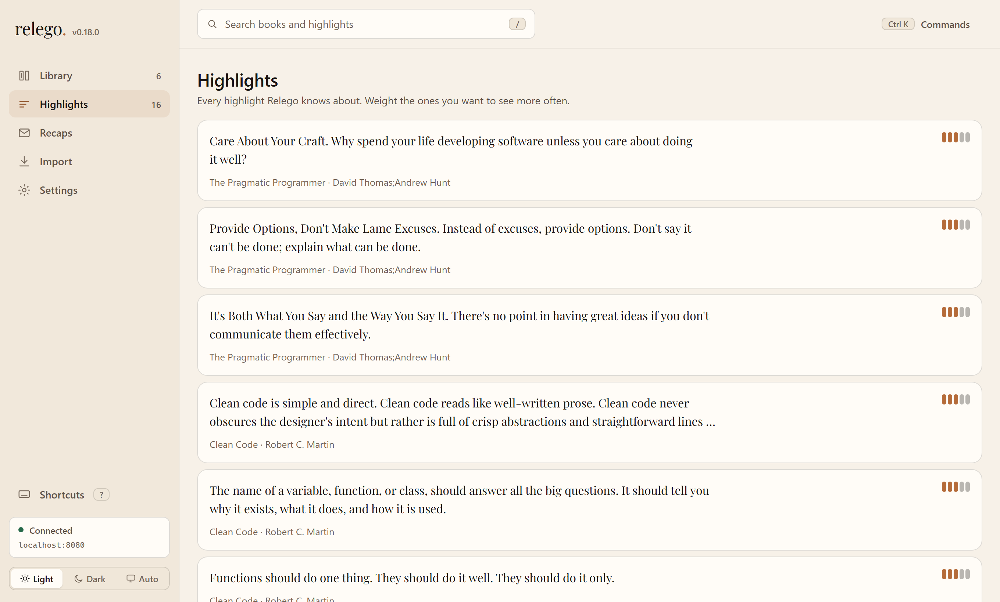

<p align="center">
  
</p>

<p align="center">
  <strong>Learn from your highlights. For free.</strong>
</p>

<h4 align="center">

  
  [](https://github.com/krusty93/relego/releases)

  [](https://opensource.org/licenses/MIT)
  [](https://github.com/krusty93/relego/actions/workflows/github-code-scanning/codeql)

  [](https://scorecard.dev/viewer/?uri=github.com/krusty93/relego)
  [](https://www.bestpractices.dev/projects/13547)

</h4>

<p align="center">
  <a href="#how-it-works">How it works</a> ·
  <a href="#see-it">See it</a> ·
  <a href="#web-ui">Web UI</a> ·
  <a href="#getting-started">Getting started</a> ·
  <a href="#cli-reference">CLI</a>
</p>

## Why relego.

Relego comes from the Latin *relegere*: to read again, go over carefully, review. That is the core idea of the project: bring your highlights back to Kindle so they can be revisited, not forgotten.

Capabilities:

- **E-ink first**: recaps delivered as native Kindle documents, not push notifications on your phone
- **Free and self-hosted**: no subscription, no data leaving your infrastructure
- **No lock-in**: your highlights stay yours, in an open format
- **Multiple import sources**: Kindle and Kobo are supported today, with a documented source registry for future integrations
- **Privacy**: your reading habits are not sent to any cloud service
- **Two front-ends**: a local web UI in your browser, or the terminal UI and CLI

## See it


---

## How it works

1. Connect a Kindle or Kobo via USB and run `relego import` to import highlights from `My Clippings.txt` or `.kobo/KoboReader.sqlite`
2. The server selects a daily or weekly subset of highlights using spaced repetition (weighted by your preferences)
3. A recap is sent through your configured delivery channel: Send-to-Kindle for Kindle, or the regular inbox email channel for Kobo users
4. Open the recap on your Kindle or in your inbox and revisit what mattered

`relego import` uses an open highlight-source registry. Kindle and Kobo are built in today; if both are connected, Relego imports both in one run and reports any per-source failure without stopping the other import. Contributors can add another source by implementing `IHighlightSource` and registering it once. See [CONTRIBUTING.md](CONTRIBUTING.md#adding-a-new-highlight-source) and [docs/ARCHITECTURE.md](docs/ARCHITECTURE.md) for the design.

### What a recap looks like

Each recap is an EPUB document delivered to your Kindle. Here's an example of what you'll see when you open it:

> #### Relego Daily Recap (2026-05-21 18:00)
>
> - _"Care About Your Craft"_
>   — **The Pragmatic Programmer** by David Thomas & Andrew Hunt
>
> - _"Clean code is simple and direct."_
>   — **Clean Code** by Robert C. Martin
>
> - _"In a hole in the ground there lived a hobbit."_
>   — **The Hobbit** by J.R.R. Tolkien
>
> - _"The only way to do great work is to love what you do."_
>   — **Steve Jobs** by Walter Isaacson
>
> - _"Violence is the last refuge of the incompetent."_
>   — **Foundation** by Isaac Asimov

Each highlight includes the quote, the book title, and the author, making it easy to recall context at a glance. The number of highlights per recap is configurable (default is 5).

## Web UI

`docker compose --profile server up -d` also starts **relego-web** on <http://localhost:8081>. It is the easiest way to run Relego day to day: everything the TUI does, in the browser, on desktop or phone.

<picture>
  <source media="(prefers-color-scheme: dark)" srcset="docs/assets/web-ui-dark.png">
  
</picture>

- **Library** — every book, its highlight count, and whether it is in the recap rotation. Rename a book inline.
- **Highlights** — search, expand a highlight in place, set its recap weight 1–5, exclude or delete it. Deletions come back with an undo.
- **Import** — drag `My Clippings.txt` or `KoboReader.sqlite` onto the page. No USB mount, no CLI, no device detection: the file is parsed on the server and you get a per-book summary of what was added and what was already there.
- **Recaps** — when the next one goes out, what is in the rotation, the delivery history, and a "Send recap now" button.
- **Settings** — delivery addresses, schedule, and the SMTP server itself, each with a test button. SMTP saved here is stored in the database and takes precedence over the environment variables, which only seed the first boot. The password is write-only: it is never sent back to the browser.

It is keyboard-first. `Ctrl`/`⌘` `K` opens the command palette, `/` focuses search, `g` then `l` / `h` / `r` / `i` / `s` jumps between views, `j` / `k` move through lists, `t` cycles light → dark → system, and `?` shows every shortcut. Light, dark, and system themes are all first-class; the default follows your OS.

Point the browser at a different server with `RELEGO_API_URL` on the `relego-web` service, and add that browser origin to `RELEGO_CORS_ORIGINS` on `relego-server`.

> [!IMPORTANT]
> Like the REST API, the web UI has **no authentication**. Anything that can reach the two published ports can read your highlights and change your settings, including the SMTP password. Keep both on a trusted network, or put them behind your own reverse proxy and auth layer. Do not expose them to the public internet.

## Interactive mode

Run `relego` without arguments to open the interactive TUI. Use it to configure the server, browse highlights, and manage exclusions. For automation and scripting, use the CLI commands directly (see CLI reference).

Theme selection for TUI:

- `RELEGO_THEME=dark` (default)
- `RELEGO_THEME=light`

---

## Getting started

### 1. Connect your reading device

Connect your Kindle or Kobo device to your computer via USB cable.

> **No device handy?** Sample Kindle and Kobo files are included under `docs/examples/`.

### 2. Run the server

Fill in `KINDLE_EMAIL` and the `SMTP_*` variables in `docker-compose.yml`, then:

```sh
docker compose --profile server up -d
```

This starts the API on <http://localhost:8080> and the [web UI](#web-ui) on <http://localhost:8081>. Steps 3 to 6 below use the CLI; you can do all of them in the browser instead.

> [!IMPORTANT]
> Amazon Send-to-Kindle only accepts emails from approved senders. Add the email address you are going to use in your Amazon "Approved Personal Document E-mail List" before testing delivery.

> [!TIP]
>
> Gmail and Outlook personal accounts do not support SMTP with password authentication anymore.
>
> Use a free SMTP relay like [AWS SES](https://aws.amazon.com/ses/), [Resend](https://resend.com/docs/send-with-smtp), [MailerSend](https://www.mailersend.com/help/smtp-relay) or [Mailgun](https://www.mailgun.com/features/smtp-server/) instead. They offer free tiers with generous limits, suitable for Relego's everyday usage. Otherwise, you can use your own SMTP relay server.
>
> If you don't have or don't want to setup any SMTP server now, replace the SMTP settings in the `relego-server` block with the demo-mode block from `docker-compose.yml`, then run the `demo` profile: `docker compose --profile demo up -d`.

### 3. Import your highlights

It's time to import the highlights from your device.

> **Using the sample data `docs/examples/kindle-highlights.txt`?** Append the local path to the `import` command shown in this section

<details>
  <summary>Docker (no install)</summary>
  
**Windows**:

The simplest option is copying `My Clippings.txt` in the repo's root folder and mount that path:

```powershell
docker compose run --rm `
  -v "$(Get-Location):/kindle:ro" `
  relego-cli import "/kindle/My Clippings.txt"
```

> If you don't want to manually copy and paste the file, follow the [Microsoft documentation](https://learn.microsoft.com/en-us/windows/wsl/connect-usb) to allow WSL to access the Kindle device.

**macOS** (Kindle mounts at `/Volumes/Kindle`):

```sh
docker compose run --rm \
  -v "/Volumes/Kindle/documents:/media/host/Kindle/documents:ro" \
  relego-cli import "/kindle/My Clippings.txt"
```

**Linux** (Kindle mounts at `/media/$USER/Kindle`):

```sh
docker compose run --rm \
  -v "/media/$USER/Kindle/documents:/media/host/Kindle/documents:ro" \
  relego-cli import "/kindle/My Clippings.txt"
```

</details>

<details>
  <summary>Windows</summary>

#### winget

  ```powershell
  winget install Krusty93.Relego
  relego
  ```

#### Binary

```powershell
irm https://raw.githubusercontent.com/Krusty93/relego/main/install.ps1 | iex
relego import
```

The installer detects your Windows architecture automatically and prints the path where `relego.exe` was saved.

</details>

<details>
  <summary>macOS / Linux</summary>

  ```sh
  curl -fsSL https://raw.githubusercontent.com/Krusty93/relego/main/install.sh | sh
  ~/.local/bin/relego
  ```

  The installer detects your OS and architecture automatically and prints the path where `relego` was saved. If `~/.local/bin` is not already on your `PATH`, add `export PATH="$HOME/.local/bin:$PATH"` to your shell profile (`~/.zshrc`, `~/.bashrc`, or `~/.profile`), then open a new terminal.

</details>

### 4. Set the recap destination

Set your Kindle email:

```sh
# Docker
docker compose run --rm relego-cli config kindle-email "email@kindle.com"

# Binary
relego config kindle-email "email@kindle.com"
```

Optionally, set an **"Also Email Recap to"** address to also receive an HTML recap in any regular inbox (in addition to Kindle). Kobo users should set this regular inbox address, because Kobo devices do not have a Send-to-Kindle-style email channel:

```sh
# Docker
docker compose run --rm relego-cli config delivery-email "you@example.com"

# Binary
relego config delivery-email "you@example.com"
```

Leave this blank if you only want Kindle delivery. Clear it at any time with `relego config delivery-email ""`.

### 5. Explore the TUI

The TUI lets you sync highlights from Kindle or Kobo sources, browse your library, manage exclusions, and adjust settings, all without leaving the terminal. To open it, launch the CLI without any argument:

```sh
# Docker
docker compose run --rm relego-cli

# Installed CLI
relego
```


If you prefer the CLI over the TUI, see the [CLI reference](#cli-reference) below.

That's it. The server is now running and will send recaps on the default schedule (every day at 18:00 in the server's local time zone).

### 6. Your first daily recap

If you don't want to wait for the scheduled send, use the following command to force the send:

```sh
# Docker
docker compose run --rm relego-cli recap trigger

# Installed CLI
relego recap trigger
```

If you've been using the demo mode, open `http://localhost:5000` to view the captured email with the EPUB attachment, download it and forward it to your real Kindle email

### Troubleshooting

| Symptom | Fix |
|---------|-----|
| `relego recap trigger` returns an error | Verify the server is up with `docker compose ps`. |
| Trigger returns `No eligible highlights available` | No highlights imported yet. Run the import step first. |
| Web UI shows "Disconnected" | The browser cannot reach the API. Check `docker compose ps`, then confirm the origin you opened matches `RELEGO_CORS_ORIGINS` on `relego-server`. |
| No email in smtp4dev | Check that the `demo` profile is running, and that the `relego-server` environment block is using `ASPNETCORE_ENVIRONMENT=Development`, `SMTP_HOST=smtp4dev`, and `SMTP_PORT=2525`. |
| smtp4dev web UI is blank | smtp4dev renders after a moment. Refresh the page. |

---

## CLI reference

|                   Command                              |              Description                                                     |
|--------------------------------------------------------|------------------------------------------------------------------------------|
| `relego`                                               | Open interactive TUI                                                         |
| `relego import [path]`                                 | Import highlights from a detected Kindle or Kobo source                      |
| `relego status`                                        | Show server status and next recap                                            |
| `relego config show`                                   | Show all current server settings                                             |
| `relego config schedule <daily\|weekly> [HH:MM]`       | Set recap schedule                                                           |
| `relego config schedule show`                          | Show current schedule                                                        |
| `relego config count show`                             | Show current highlights-per-recap setting                                    |
| `relego config count <1-15>`                           | Set highlights per recap (default: 5)                                        |
| `relego config email kindle <address>`                 | Set the Send-to-Kindle email address                                         |
| `relego config email inbox <address>`                  | Set the inbox email address for HTML recap delivery. Pass `""` to clear      |
| `relego exclude add <highlight\|book\|author> <id>`    | Exclude an entity from future recaps                                         |
| `relego exclude remove <highlight\|book\|author> <id>` | Re-include an excluded entity                                                |
| `relego exclude list`                                  | List all exclusions                                                          |
| `relego rename-book <id> <title>`                      | Rename a book                                                                |
| `relego weight set <id> <1-5>`                         | Set highlight weight                                                         |
| `relego weight list`                                   | Show weighted highlights                                                     |
| `relego recap trigger`                                 | Trigger a recap immediately                                                  |
| `relego --version`                                     | Print version                                                                |

---

## Known Limitations

The current version imports highlights from Kindle `My Clippings.txt` and Kobo `.kobo/KoboReader.sqlite` sources. Kindle recaps can be delivered through Send-to-Kindle email; Kobo users use the regular inbox email channel because Kobo has no Send-to-Kindle-style address.

Additional import sources and delivery targets are planned. If you wish to add your own, see the next section.

## For contributors

Relego is an open source project and the highlight-source layer is built to be extended. The quickest way to understand the project is to read the product context in [docs/prds/prd-mvp.md](docs/prds/prd-mvp.md), the source registry overview in [docs/ARCHITECTURE.md](docs/ARCHITECTURE.md), then the contributor guide section on [adding a new highlight source](CONTRIBUTING.md#adding-a-new-highlight-source).

---

## Supply chain verification

Verify Docker image origin via GitHub CLI:

```sh
gh attestation verify \
  oci://ghcr.io/krusty93/relego.server:latest \
  --owner Krusty93
```

```sh
gh attestation verify \
  oci://ghcr.io/krusty93/relego.cli:latest \
  --owner Krusty93
```

---

## Contributing

Contributions are welcome. See [CONTRIBUTING.md](CONTRIBUTING.md) for guidelines. Useful documentation:

- [MVP Product Requirements Document](docs/prds/prd-mvp.md)
- [Developer Experience Design](docs/DX.md)
- [Architecture](docs/ARCHITECTURE.md)
- [Architecture Decision Records](docs/adr/)

## License

MIT, see [LICENSE](LICENSE).
