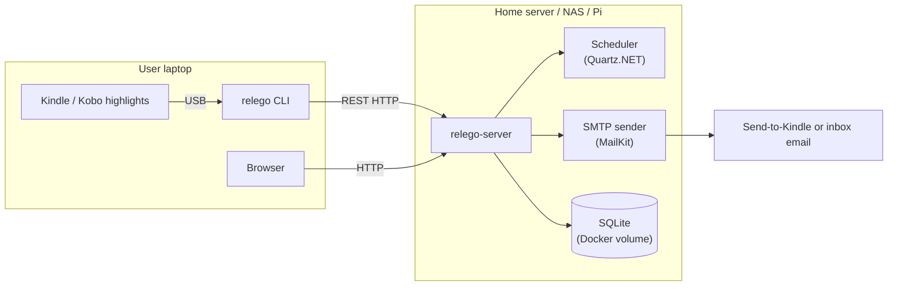

# Architecture — Relego

**Version:** 0.2 — Draft
**Date:** 2026-06-02
**Status:** Draft

---

## System Overview

Relego follows a client/server architecture. The server is the only always-on component; it hosts the React web UI and REST API together, while the CLI remains an optional client.



---

## Components

### Client CLI (`relego`)

- Distributed as a self-contained binary (macOS/Linux/Windows) or runnable via Docker
- Optional Docker image for no-install usage: `ghcr.io/krusty93/relego.cli`
- Reads the server URL from client configuration (`Server:Url`) with runtime override via `SERVER_URL` (no authentication — local network trusted)
- Responsibilities:
  - Parse and sync highlights from registered highlight sources to the server (Kindle and Kobo today)
  - Manage user settings via CLI commands (schedule, count, weights, exclusions)
  - Display server status

#### Highlight source registry (`Relego.Core/Sources/`)

The CLI imports through an open source registry rather than a closed source-type enum. Each source implements `IHighlightSource`, owns a stable `SourceDescriptor` (`Id`, `DisplayName`), implements its own `Locate(string? userPath)` detection rules, and returns the existing `ParseResult` from `ReadAsync`. The `HighlightSourceResolver` receives `IEnumerable<IHighlightSource>` from DI, calls each source's `Locate`, and returns every detected source without per-source branching.

The registry, the parsers (`Relego.Core/Parsing/`) and the device detectors live in `Relego.Core` so both front-end paths can use them: the CLI detects a mounted device and reads it locally, while the server parses the same formats from an uploaded file (`POST /imports`). Registering a new source therefore adds it to both surfaces at once.

Current sources:

- `KindleClippingsSource`: reads Kindle `.txt` clippings exports. Explicit file paths are accepted by `.txt` extension; auto-detection uses the existing Kindle detector to probe for `My Clippings.txt` on mounted devices.
- `KoboReaderSource`: detects and reads `.kobo/KoboReader.sqlite`. It copies the SQLite database to a temp file, validates the SQLite header, opens the copy read-only, and deletes the copy afterward so the mounted device database is never modified.

Adding a future integration is intentionally small: implement `IHighlightSource` and register one `AddSingleton<IHighlightSource, NewSource>()` line in `Program.cs`. Do not add a central enum, and do not edit the resolver, import workflow, or command surface for source-specific branching. `SourceDescriptor` is a reporting/logging label only.

When more than one source is detected, the import workflow imports all of them in one run. Each source is read and synced independently; a failure in one source is reported in the per-source summary and does not stop the remaining detected sources from importing. This behavior follows ADR-008 sections 3 and 5.

Kobo support is import-only. Kobo has no Send-to-Kindle-style email address, so no new server, schema, sync API, scheduler, recap composition, or device-delivery channel was added. Kobo users receive recaps through the existing regular inbox email channel (`delivery_email`, ADR-007 / feature 009).

All sources are responsible for transforming raw source data into structured data before syncing to the server.

- **Entry point**: `ClippingsParser.ParseAsync(string filePath, ILogger? logger = null)` — file-path overload; `ClippingsParser.ParseAsync(TextReader, ILogger? logger = null)` — streaming overload for testability
- **Output types**:
  - `ParseResult` — top-level result: list of `ParsedBook`, total entries processed, duplicates removed
  - `ParsedBook` — `(Title, Author?, IReadOnlyList<ParsedHighlight> Highlights)`
  - `ParsedHighlight` — `(Text, Location?, AddedOn?)`
- **Design decisions**:
  - Streaming for Kindle text: reads lines one-by-one via `ReadLineAsync()`; no full file in memory
  - Skip-and-warn: malformed entries are skipped with an `ILogger.LogWarning`; never throws
  - Deduplication: `HashSet<(Title, Author, Text)>` — exact case-sensitive match, first occurrence kept
  - Notes as highlights: entries of type "Note" are emitted as highlights with `[my note] ` prefix on their text
  - Bookmarks: entries of type "Bookmark" are silently dropped
  - Shared aggregation: `HighlightAggregator` performs deduplication and grouping for every source so Kindle and Kobo produce identical downstream shapes

#### TUI subsystem (`Relego.Cli/Tui/`)

> **Deprecated:** The TUI is deprecated in favour of the `relego.web` project. It will be removed in a future release.

When invoked with no arguments in an interactive terminal (`relego`), the client enters **TUI mode** — a full-screen terminal UI powered by [Terminal.Gui](https://github.com/gui-cs/Terminal.Gui) (v2).

**Dual-mode launch** (`Program.cs`): if `args.Length == 0 && !Console.IsInputRedirected`, `TuiApp.RunAsync()` is called; otherwise the Spectre.Console `CommandApp` handles the sub-command (e.g. `relego sync`).

### Server (`relego-server`)

- Distributed as a Docker container
- Published to GHCR as `ghcr.io/krusty93/relego.server`
- Always-on, handles all automated operations
- Responsibilities:
  - Store highlights, recap history, weights, exclusions, settings in SQLite
  - Run scheduled recap generation (daily or weekly, configurable time)
  - Select highlights via spaced repetition algorithm
  - Compose recap document and send via SMTP to Kindle email address
  - Serve the React web UI and REST HTTP API from one origin

#### REST API layer (`Relego.Server/`)

The server currently exposes the MVP storage API as ASP.NET Minimal APIs.

- Composition root: `Program.cs`
- Endpoint modules: `Endpoints/`
- Data access: `Data/`
- Shared request/response contracts: `Relego.Core/Contracts/`
- OpenAPI: Swagger UI is enabled only in Development

The application registers a scoped `IDbConnection` backed by `Microsoft.Data.Sqlite`, opens the connection per request, enables SQLite foreign keys via `PRAGMA foreign_keys = ON`, and resolves thin repository classes over that connection.

Endpoint groups currently implemented:

- Sync: bulk import via `POST /highlights/import`
- Import: multipart upload via `POST /imports` — accepts `My Clippings.txt` or `KoboReader.sqlite`, sniffs the format, parses with `Relego.Core`, and returns a per-book summary of added and duplicate highlights
- Settings: `GET /settings`, `PATCH /settings`, `POST /settings/test-kindle-email`, `POST /settings/test-recap-email`
- SMTP settings: `GET /settings/smtp`, `PUT /settings/smtp`, `POST /settings/smtp/test`
- Status: `GET /status`
- Recap: `POST /recaps`, `GET /recaps` (delivery history)
- Highlights: `GET /highlights`, `DELETE /highlights/{id}`
- Books: `GET /books`, `PUT /books/{id}/title`
- Exclusions: `*/{id}/exclusions` plus `GET /exclusions`
- Weights: `PUT /highlights/{id}/weight`, `GET /highlights/weights`

#### SMTP configuration precedence

SMTP settings live in the `smtp_settings` table so they can be changed from the web UI without restarting the container. On first boot, when the table is empty, the `SMTP_*` environment variables seed it. From then on the database is authoritative and the environment variables are ignored; `SmtpConfigurationService` is the single read path used by `MailDeliveryService`. The password is never returned by `GET /settings/smtp`, and omitting it from `PUT /settings/smtp` keeps the stored value.

### Web UI (`src/relego.web/`)

Single-page application built with Vite and referenced by `Relego.Server` through `relego.web.esproj`. During `dotnet publish`, its production build is added to the server's `wwwroot` output as static web assets. ASP.NET Core serves those assets and the SPA fallback from the same origin as the API, so no browser CORS policy or runtime API URL configuration is needed.

- **Tech stack**: Vite 7, React 19, TypeScript, React Router, TanStack Query. Plain CSS with a token layer.
- **Same-origin API calls**: browser requests use relative paths, so the web UI always talks to the server that served it.
- **Offline-capable assets**: fonts are bundled (`@fontsource/playfair-display`); nothing is fetched from a CDN at runtime, which matters for a self-hosted tool on an isolated network.
- **Routes**: `/` library · `/books/{id}` one book's highlights · `/highlights` all highlights · `/recaps` · `/import` · `/settings`
- **Accessibility**: every route is verified with axe-core in both themes at desktop and mobile widths, plus the command palette, shortcut sheet, expanded highlight, and rename dialog. The suite fails on any violation.
- **Build**: `dotnet publish src/Relego.Server` restores the locked npm dependencies, runs the Vite production build, and writes the assets to the server publish output's `wwwroot/`. `cd src/relego.web && npm run build` remains available for frontend-only work.
- **Tests**: `cd src/relego.web && npm test` — Playwright builds the SPA, starts `relego-server` against a throwaway SQLite file, seeds the fixtures used by the .NET tests, then runs the behavioural and accessibility suites.
- **Integration**: `relego.web.esproj` is included in `Relego.slnx` and referenced by the server to define one publishable server-and-web artifact. The React source, dependencies, and frontend test tooling remain independent from the .NET implementation.

---

### Landing Page (`src/landing/`)

Static marketing landing page built with Astro and Tailwind CSS. Completely independent from the .NET solution: separate `package.json`, separate build, separate test suite.

- **Tech stack**: Astro 6, Tailwind CSS v4 (via PostCSS), Playwright for E2E testing
- **Deployment target**: GitHub Pages (static HTML output, no server required)
- **Build**: `cd src/landing && npm run build` → outputs to `src/landing/dist/`
- **Tests**: `cd src/landing && npx playwright test` — Chromium-only, includes axe-core accessibility audit
- **Separation**: no shared code, no shared dependencies with the .NET projects; the landing page can be deployed and developed independently

---

## Technology Stack

| Component                | Technology                                 | Rationale                                                 |
|--------------------------|---------------------------------------------|-----------------------------------------------------------|
| Language / runtime       | .NET 10 (C#)                   | Cross-platform, self-contained binaries, rich ecosystem |
| Client distribution      | Single-file binary / Docker    | Zero runtime dependency for end users                   |
| Server distribution      | Docker container | One server-and-web artifact for self-hosted deployment |
| Storage                  | SQLite (file in Docker volume) | Zero config, single file, no extra container            |
| Client/server protocol   | REST HTTP                      | Simple, debuggable, universally supported               |
| Email delivery           | MailKit + SMTP                 | Industry standard, supports Send-to-Kindle              |
| Logging                  | Serilog (file + SQLite sink)   | Structured logging, persistent, queryable               |
| Scheduling               | Quartz.NET                     | Mature .NET scheduler, cron-style expressions           |
| CLI UX                   | Spectre.Console                | Rich terminal output, tables, progress bars             |
| Web UI                   | Vite + React + plain CSS       | Static build published with the server, same-origin API |
| Landing page             | Astro + Tailwind CSS           | Static site generation, minimal JS, fast build          |

---

## Data Model

```
users            (id, kindle_email[''], delivery_email[NULL], created_at)
authors          (id, name)
books            (id, user_id, author_id, title)
highlights       (id, user_id, book_id, text, weight[1-5], excluded, last_seen, delivery_count, created_at)
excluded_books   (id, user_id, book_id, excluded_at)
excluded_authors (id, user_id, author_id, excluded_at)
settings         (user_id, schedule['daily'|'weekly'], delivery_day, delivery_time[default:'18:00'], count[1-15, default:3])
```

> **Delivery destinations:** both `kindle_email` and `delivery_email` are optional; at least one must be set for recap delivery. `POST /recaps` returns HTTP 422 when neither is configured; the TUI shows a persistent warning.

> **MVP note:** Single-user only. The server auto-creates or reuses user `id = 1` on demand for every API request.

Current uniqueness constraints used by the REST layer:

- `authors(name)`
- `books(user_id, author_id, title)`
- `highlights(user_id, book_id, text)`

---

## Core Query — Recap Selection

```sql
SELECT h.*
FROM highlights h
WHERE h.user_id = @userId
  AND h.excluded = 0
  AND h.book_id NOT IN (SELECT book_id FROM excluded_books WHERE user_id = @userId)
  AND h.author_id NOT IN (SELECT author_id FROM excluded_authors WHERE user_id = @userId)
ORDER BY (h.weight * RANDOM()) DESC, h.last_seen ASC
LIMIT @count
```

---

## REST API Surface

| Method   | Path                              | Description                                 | Tag        |
|----------|-----------------------------------|---------------------------------------------|------------|
| `POST`   | `/highlights/import`              | Bulk import highlights from client          | Sync       |
| `POST`   | `/imports`                        | Upload and parse a clippings or Kobo file   | Import     |
| `GET`    | `/status`                         | Server status, next recap, highlight stats  | Status     |
| `GET`    | `/settings`                       | Read current settings                       | Settings   |
| `PATCH`  | `/settings`                       | Partially update settings                   | Settings   |
| `POST`   | `/settings/test-kindle-email`     | Send a test email via Send-to-Kindle        | Settings   |
| `POST`   | `/settings/test-recap-email`      | Send a test HTML email to the inbox address | Settings   |
| `GET`    | `/settings/smtp`                  | Read SMTP settings (password never returned) | Settings  |
| `PUT`    | `/settings/smtp`                  | Update SMTP settings                        | Settings   |
| `POST`   | `/settings/smtp/test`             | Verify the SMTP connection                  | Settings   |
| `POST`   | `/recaps`                         | Execute a recap immediately                 | Recap      |
| `GET`    | `/recaps`                         | Recap delivery history                      | Recap      |
| `GET`    | `/highlights`                     | List/paginate/search highlights             | Highlights |
| `DELETE` | `/highlights/{id}`                | Delete a highlight                          | Highlights |
| `PUT`    | `/highlights/{id}/weight`         | Set highlight recap weight                  | Weights    |
| `GET`    | `/highlights/weights`             | List weighted highlights                    | Weights    |
| `GET`    | `/books`                          | List books with highlight counts            | Books      |
| `PUT`    | `/books/{id}/title`               | Rename a book                               | Books      |
| `POST`   | `/highlights/{id}/exclusions`     | Exclude a highlight                         | Exclusions |
| `DELETE` | `/highlights/{id}/exclusions`     | Re-include a highlight                      | Exclusions |
| `POST`   | `/books/{id}/exclusions`          | Exclude a book                              | Exclusions |
| `DELETE` | `/books/{id}/exclusions`          | Re-include a book                           | Exclusions |
| `POST`   | `/authors/{id}/exclusions`        | Exclude an author                           | Exclusions |
| `DELETE` | `/authors/{id}/exclusions`        | Re-include an author                        | Exclusions |
| `GET`    | `/exclusions`                     | List all exclusions                         | Exclusions |

### Data access pattern

The REST layer uses Dapper with explicit SQL rather than EF Core.

- Each repository encapsulates one domain slice and receives `IDbConnection` via DI
- Queries stay close to the endpoint behavior they support
- Sync import uses a database transaction to keep author, book, and highlight insertion consistent
- Read models returned by list endpoints are projected directly into DTOs rather than materializing richer domain aggregates

Current repository split:

- `UserRepository`: implicit MVP user bootstrap and user email persistence
- `SyncRepository`: bulk import and deduplication
- `SettingsRepository`: settings read/upsert
- `StatusRepository`: aggregate counters
- `ExclusionRepository`: inclusion/exclusion mutations and exclusion listings
- `WeightRepository`: weight updates and weighted highlight listings

### Error handling

The API returns JSON-only responses.

- Validation failures use `Results.ValidationProblem(...)` and return HTTP `422`
- Missing entities use `Results.Problem(...)` and return HTTP `404`
- Successful mutations that do not need a body return HTTP `204`
- Successful reads return HTTP `200` with DTO payloads from `Relego.Core/Contracts/`

This keeps the client protocol small, explicit, and aligned with the quickstart `curl` flows.

### Contract naming conventions

Transport objects in `Relego.Core/Contracts/` follow these suffixes:

| Suffix      | Usage                                                                                                          |
|-------------|------------------------------------------------------------------------------------------------------------------|
| `*Request`  | Inbound root-level request bodies (e.g. `SyncRequest`, `UpdateSettingsRequest`)                                |
| `*Response` | Outbound root-level response bodies (e.g. `StatusResponse`, `HighlightsResponse`)                              |
| `*Dto`      | Nested data-transfer objects used as list items or sub-objects within a response (e.g. `WeightedHighlightDto`) |

## Project structure

```tree
src/Relego.Core/
├── Branding/           # Shared wordmark and palette constants
├── Contracts/          # Shared request/response DTOs for CLI, server and web UI
├── Parsing/            # My Clippings.txt parser and shared highlight aggregation
└── Sources/            # Highlight source registry, source readers, resolver, device detectors

src/Relego.Cli/
├── Commands/           # Spectre.Console CLI sub-commands (sync, status, config, …)
├── Import/             # Device import workflow shared by the CLI and the TUI
├── Infrastructure/     # HTTP client and resilience
├── Tui/                # Terminal.Gui TUI (TuiApp, screens, StatusChrome, …)
└── Program.cs          # Dual-mode entry point (TUI or CLI)

src/Relego.Server/
├── Data/               # Dapper repositories over SQLite
├── Endpoints/          # Minimal API endpoint modules
├── Infrastructure/     # Database bootstrap and logging
├── Models/             # Server-side domain models
├── Services/           # Upload import, SMTP configuration, mail delivery
└── Program.cs          # Composition root and DI wiring

src/Relego.Tests/
├── Api/                # End-to-end HTTP integration tests via WebApplicationFactory
├── Cli/                # CLI command tests
├── Infrastructure/     # Database/bootstrap tests
├── Parsing/            # Parser tests
├── Recap/              # Recap service tests
├── Sources/            # Highlight source, resolver, and multi-import tests
└── Tui/                # TUI logic tests (mode detection, search, screen key handling)

src/relego.web/             # React/Vite SPA published with Relego.Server
├── relego.web.esproj # JavaScript SDK project referenced by the server
├── src/components/     # App shell, command palette, shortcuts sheet, primitives
├── src/routes/         # Library, Highlights, Import, Recaps, Settings
├── src/lib/            # API client, theme, hotkeys, toasts, formatting
├── src/styles/         # Design tokens and global stylesheet
└── tests/              # Playwright behavioural and axe-core accessibility suites

src/landing/                # Static marketing landing page (independent from .NET)
├── pages/              # Astro pages (index.astro)
├── components/         # Reusable Astro components (Navbar, Footer, Section, etc.)
├── config/             # Site configuration (site.ts)
├── layouts/            # Layout wrapper
├── styles/             # Global CSS with Tailwind + CSS variables
├── assets/             # Images (hero)
└── tests/              # Playwright E2E tests (navigation, theme, content, a11y)
```

---

## ADR Index

| ADR                                                     | Decision                                     |
|---------------------------------------------------------|----------------------------------------------|
| [ADR-001](adr/001-client-server-architecture.md)        | Client/server architecture                   |
| [ADR-002](adr/002-dotnet-core-runtime.md)               | .NET Core as language/runtime                |
| [ADR-003](adr/003-sqlite-storage.md)                    | SQLite as storage engine                     |
| [ADR-004](adr/004-rest-http-protocol.md)                | REST HTTP as client/server protocol          |
| [ADR-005](adr/005-my-clippings-txt-highlight-source.md) | `My Clippings.txt` as MVP highlight source   |
| [ADR-006](adr/006-docker-only-distribution.md)          | Docker-only server distribution              |
| [ADR-007](adr/007-dual-channel-email-delivery.md)       | Dual-channel email delivery                  |
| [ADR-008](adr/008-kobo-reader-sqlite-source.md)         | `KoboReader.sqlite` as Kobo highlight source |
