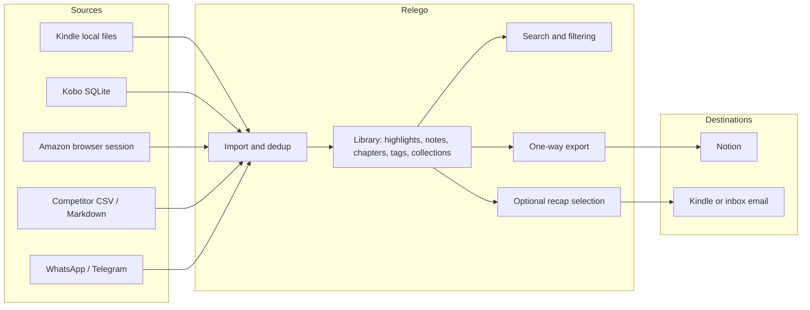

# Product Requirements Document — V1

**Version:** 1.0 - Completed
**Date:** 2026-10-02
**Status:** In progress

This document maps the product requirements behind the Relego V1 roadmap. The completed previous release is retained as a historical baseline in [`prd-mvp.md`](prd-mvp.md).
## Executive Summary

### Problem Statement

Readers who highlight on Kindle or Kobo want to collect, organize, export, and revisit those highlights, but the established tools that do this well charge a recurring subscription for what many users see as a utility.

The pricing objection is specific rather than general: a monthly fee feels disproportionate for a product whose everyday value is importing highlights, keeping them organized, and copying them somewhere else. A $5 monthly subscription is judged too expensive for that job alone.

Two further problems sit on top of the price objection:
1. **The free alternatives are constrained.** Competing free tiers limit the organization model (for example tags) and the number of export destinations, so users hit a wall exactly where the product would otherwise be useful.
2. **Self-hosting is its own barrier.** Requiring Docker, and possibly an always-on machine and an SMTP relay, blocks people who would otherwise use the product. Some users have a laptop rather than a server, and some only want the product occasionally.

### Proposed Solution

Relego becomes a credible free, open-source replacement for the paid lower tier of highlight management, so that a user can own and use their reading highlights without another subscription.

V1 solves specifically for:

- **Cost.** Deliver for free what competing products charge for on their entry tier, with no feature being reserved for a paid self-hosted edition.
- **Organization and export depth.** Match the organization and export capability that free tiers restrict, so users do not trade money for missing tags, collections, or destinations.
- **Setup friction.** Let the product be used on demand, so a user without a server can still import, organize, and export without running an always-on service or configuring email delivery.
- **Manual file handling.** Remove the repetitive step of downloading and uploading a clippings file, using the same approach established products use.
- **Lock-in.** Keep highlights portable through open formats and dedicated integrations, and keep credentials under user control.
- **Extensibility.** Make community-built sources and destinations practical instead of requiring users to wait for first-party connectors.

The roadmap explicitly does **not** set out to win a connector-count war, to match a full reading application, or to establish a technical moat. Giving price-sensitive users a good free option is sufficient for this effort.

### Success Criteria

- **Feature completeness.** V1 is complete only when every requirement in this document is present. The iteration is the complete initial proposition rather than a partial slice.

- **Portability.** A user can leave a paid competitor by importing its comma-separated export without an account connection or API token, and can re-import Relego's own portable exports without documented field loss or duplicates.
- **Honest disclosure.** Public copy and documentation state shipped, planned, and externally constrained capabilities, and never assert blanket privacy claims or unverified figures.

No numeric targets (deadlines, budgets, conversion, or retention metrics) were agreed in the roadmap.
## Users, Positioning, and Product Promise

### Target Users

The target user is the price-sensitive portion of the highlight-management audience, including:

- current subscribers to competing paid tools,
- people who would subscribe but will not pay,
- people who only need import and export.

The self-hosted audience is assumed to already have a machine, containerization, and eventually SMTP. Users who lack those should still get value from on-demand, file-based workflows.

### Product Promise

The product promise is: **"Own and use your reading highlights without another subscription."**

Import, organization, export, and recaps serve that promise. Calling Relego "free Readwise" was rejected, because it lets a competitor define the product.

### Competitive Posture

- Relego wins on price, openness, and ownership rather than breadth.
- Readwise's lower tier is the pricing comparison; Readwise's reading application is out of scope as a target.
- The comparison that shaped the organization and export scope is a free competitor tier that is more permissive than Readwise's on price but restricts organization and offers only a few export types, of which only one is a knowledge-management destination.
- Competitor prices, limits, and export lists change. Any figure used in public copy must be re-verified against the vendor's current documentation rather than repeated from earlier research.

## Scope and Release Definition

The V1 iteration is the complete initial proposition rather than a partial slice: every requirement in this document must be present for the release to be considered complete.

Requirements are identified as `FR-XX` (functional) and `NFR-XX` (non-functional).

## Functional Requirements

### V1 Iteration

- **FR-01** — Kindle Background Synchronization (Must)
- **FR-02** — Reading Annotations, Notes, and Chapters (Must)
- **FR-03** — File Migration and Portable Formats (Must)
- **FR-04** — WhatsApp and Telegram Capture (Must)
- **FR-05** — Organization: Tags, Collections, Search, and Filtering (Must)
- **FR-06** — Notion Export (Must)
- **FR-07** — Optional Recaps (Must)
- **FR-08** — Extension Contracts (Must)
- **FR-09** — Product Site and Documentation Refresh (Must)

#### FR-01 — Kindle Background Synchronization

**Priority:** Must

**Requirement.** Kindle highlights are imported automatically in the background by copying the approach established products use, without Relego presenting an Amazon password form or storing Amazon credentials.

**Acceptance criteria:**

- Copy the approach used by the established products rather than inventing one.
- Import happens automatically in the background while the required components are available; a routine import must not require pressing a button per book.
- The user authenticates directly with Amazon on Amazon's own surface. Relego must not present an Amazon password form of its own.
- Login with Amazon OAuth is not treated as authorization to Kindle highlights; its profile scopes do not include them.
- The documented competitor behavior is the reference for the experience: initial sync progress and completion, a visible indication when authentication has expired, a full resync action, and a reminder when nothing new has been synchronized for a long period.
- No headless backend Amazon login, no CAPTCHA or MFA bypass, and no Amazon session cookies or passwords stored on the server.
- Provider constraints are disclosed rather than hidden: cloud coverage versus locally sideloaded documents, and publisher export limits that can truncate a book's highlights.
- Local device import stays available as the reliable path for content the web surface does not cover.
- Retrying or fully resynchronizing previously imported content must not duplicate it, and upstream changes must surface as an actionable failure instead of a silent success.

**Excluded.** Email-based ingestion of the kind a competitor offers through a dedicated forwarding address.

#### FR-02 — Reading Annotations, Notes, and Chapters

**Priority:** Must

**Requirement.** Highlights, notes, and chapter structure are imported from local Kindle and Kobo sources and preserved faithfully, including explicit heading annotations.

**Acceptance criteria:**

- Keep the existing local Kindle and Kobo import paths; importing must not modify the device data, and a failure in one selected source must not hide another source's outcome.
- Preserve highlight text, associated notes, available title and author, source location, and timestamps.
- Missing information stays unknown; it is never synthesized.
- Chapters follow the competitor's documented approach: explicit heading annotations that mark a highlight as a first-, second-, or third-level heading, which the user captures while reading.
- Chapter hierarchy is derived from those explicit markers and source order. Guessing chapters from highlight text or location was rejected.
- Records without chapter information remain usable and filterable as unknown rather than being excluded from the product.
- Heading annotations are distinguishable from ordinary highlights in the library and in exports.
- Existing records imported by the earlier release must keep working; legacy notes must not be destructively reinterpreted without an explicit migration rule.

#### FR-03 — File Migration and Portable Formats

**Priority:** Must

**Requirement.** A user can migrate highlights in from and out to documented file formats without losing documented fields or creating duplicates.

**Acceptance criteria:**

- Import the leading competitor's comma-separated export without requiring an account connection or an API token, so a user can leave the paid service and keep their highlights.
- A generic comma-separated import uses an explicit schema or column mapping rather than guessing arbitrary column names.
- A documented Markdown convention is accepted, with its metadata and annotation boundaries defined. Compatibility with every Markdown dialect is not claimed.
- Supported fields survive import: text, notes, book and author, headings, locations, tags, source identifiers, and dates. The compatibility matrix must state which fields a given format actually carries.
- Import reports added, duplicate, rejected, and unsupported records instead of failing silently.
- Relego's own portable exports can be re-imported without losing documented fields or creating duplicates.
- Credentials and private tokens are never included in exports.

#### FR-04 — WhatsApp and Telegram Capture

**Priority:** Must

**Requirement.** Authorized users can send or forward highlights to Relego over WhatsApp and Telegram, and Relego ingests the deliberately sent content.

**Acceptance criteria:**

- Both integrations belong to this iteration; deferring them to a later phase was rejected.
- They use the platforms' supported APIs. Existing provider APIs are required rather than bespoke workarounds.
- The flow mirrors an established knowledge tool: the user sends or forwards a message to a Relego destination, and the backend ingests the content. Personal conversation history is never harvested.
- Only authorized senders or routes may write into the configured library, and connecting or disconnecting has a visible state.
- Missing book, author, or chapter context must not prevent capture or cause invented metadata.
- Redelivery is deduplicated, and capture is not acknowledged before it is durably stored.
- Provider outages, expired credentials, unsupported payloads, and rejected messages must be distinguishable.
- Prerequisites and provider fees are documented rather than hidden.
- Bot or number ownership, polling versus webhooks, the exact public endpoint, supported payload types, and offline delivery windows are set aside as implementation and interaction decisions for the feature specification.

#### FR-05 — Organization: Tags, Collections, Search, and Filtering

**Priority:** Must

**Requirement.** The library is organized with flat tags and collections, and is searchable and filterable by book, author, chapter, tag, and collection.

**Acceptance criteria:**

- The baseline is tags, collections, full-text search, and filtering by book, author, chapter, tag, and collection.
- Collections are required in this iteration, not deferred; tags alone are not the organization model.
- Tags are flat and reusable; nested taxonomies and automatic AI classification are not part of this iteration.
- Records without book or chapter metadata remain discoverable.
- Existing weights and exclusions are preserved and keep their effect on recap selection; organization changes must not silently reset them.
- Collection membership granularity and combined-filter semantics are left to the feature specification so that collections are not implemented as a simple alias for tags.

#### FR-06 — Notion Export

**Priority:** Must

**Requirement.** Relego provisions and maintains a one-way Notion export that copies the established competitor's behavior, appending new highlights to existing pages exactly once.

**Acceptance criteria:**

- Copy the established competitor's behavior rather than designing new semantics.
- After authorization, Relego provisions its own database and page structure in the selected workspace, with filtered views, and one page per source document.
- Initial export continues in the backend after the browser is closed, as long as Relego is running.
- Export runs automatically on a schedule and can also be started immediately on demand. The scheduling interval must be stated explicitly; the competitor's documentation describes it inconsistently, so its wording is not treated as a precise contract.
- Notion is the only dedicated knowledge-management connector in this iteration.
- Export is one-way from Relego, which stays the source of truth. Two-way synchronization was rejected for now.
- New highlights append to their existing document page exactly once at the product level, using durable associations and retry reconciliation.
- Content authored or edited in Notion is never overwritten or deleted, and Notion-side edits do not flow back.
- Renaming or moving accessible pages does not break identity, and remote custom properties are preserved.
- A lost connection, or a change to a required property's type, produces an actionable repair state rather than silent corruption.
- Heading structure and location information are included where available.
- No automatic destructive deletion in either direction. Reset and re-export require an explicit recovery design rather than an assumed behavior.

#### FR-07 — Optional Recaps

**Priority:** Must

**Requirement.** The existing scheduled and on-demand recap delivery to the reading device and to an inbox is preserved as an optional capability that never blocks library operations.

**Acceptance criteria:**

- Keep scheduled and on-demand delivery to the reading device and to an inbox, configured individually or together, including recap size, exclusions, weights, delivery outcomes, and history.
- Recaps remain optional. Review is not a prerequisite for importing, organizing, or exporting.
- Requesting delivery without the required configuration returns an actionable error without blocking library operations.
- Provider failures and retries must not record a delivery as successful.
- The existing weighted resurfacing must not be described as adaptive review scheduling, and sending a recap is not evidence that it was read or remembered.

#### FR-08 — Extension Contracts

**Priority:** Must

**Requirement.** Documented contracts let first-party and community adapters add sources and destinations without modifying core workflows.

**Acceptance criteria:**

- Publish documented contracts for adding sources and destinations so contributors do not need to modify core workflows.
- First-party and community adapters use the same boundaries, with version and capability declarations plus explicit configuration and error contracts.
- The existing registered-source pattern is extended rather than replaced by a closed connector enumeration.
- Provider-specific transport, parsing, quotas, and credentials stay outside the core reading domain.
- The roadmap deliberately does not pursue bespoke connectors for services that are not part of the agreed set; the architecture should instead make community plugins easier to build.
- Dynamic installation, a marketplace, and untrusted plugin execution are not required in this iteration.

#### FR-09 — Product Site and Documentation Refresh

**Priority:** Must

**Requirement.** The product site and documentation present the ownership and subscription-free promise and the real, bounded capabilities honestly.

**Acceptance criteria:**

- Rework the product site around the ownership and subscription-free promise, the supported import, export, and organization capabilities, optional recaps, open-source status, and extension support.
- Distinguish clearly between shipped, planned, and externally constrained capabilities.
- State browser and session requirements, self-hosting prerequisites, optional provider fees, and privacy boundaries honestly.
- Avoid blanket privacy claims that no data leaves the deployment, and avoid inventing usage figures, testimonials, competitor limitations, or learning outcomes.

## Non-Functional Requirements

- **NFR-01** — Edition parity and licensing (Must). The self-hosted edition is free and feature-complete, licensed under MIT or Apache 2.0; no capability is reserved for a paid self-hosted edition.
- **NFR-02** — Local-first data handling (Must). Relego adds no mandatory account, telemetry, or hidden transfer; data reaches a third party only through an integration the user deliberately configures, and credentials remain under user control.
- **NFR-03** — Operational resilience (Must). Interrupted or failed operations report an actionable outcome and can be retried without duplicating results; retries and full resyncs never duplicate already-imported content.
- **NFR-04** — Portability and openness (Must). Highlights remain portable through open, documented formats; Relego's own exports re-import without documented field loss or duplicates, and exports never include credentials or private tokens.

- **NFR-05** — Non-destructive operation (Must). There is no automatic destructive deletion in either direction; reset and re-export require an explicit recovery design.
- **NFR-06** — Extensibility boundary (Should). Sources and destinations are added through stable, documented contracts with version and capability declarations, while provider-specific transport, parsing, quotas, and credentials stay outside the core reading domain.
- **NFR-07** — Security posture (Must). Relego never presents an Amazon password form or stores Amazon sessions or passwords, never bypasses CAPTCHA or MFA, treats untrusted source text as data rather than instructions, and redacts credentials from prompts and logs.
- **NFR-08** — Managed-service readiness (Should). Ownership boundaries are clear, secrets are configurable, storage and integration interfaces are replaceable, and no code assumes that exactly one global user exists.
- **NFR-09** — Honest disclosure (Must). Provider prerequisites, fees, coverage limits, browser and session requirements, and privacy boundaries are documented, without blanket privacy claims or invented figures.
- **NFR-10** — Cost transparency (Must). Costs charged by external providers (messaging, email, model usage) are separate from Relego and are disclosed.
- **NFR-11** — Availability expectation (Must). Automatic work runs only while its required components are running; availability while everything is stopped is not promised.

## Technical Specifications

### Architecture Overview

Relego is a self-hosted tool made of a client and a server:

- **`relego` CLI (client)** — runs where the user has their devices and files; used to import from connected devices and to drive the server.
- **`relego-server` (server)** — a container that stores the library, runs scheduled work, and serves the web interface.

Key architectural behaviors required by this roadmap:

- The **web interface is the primary management surface**; the CLI remains optional.
- **One product serves both on-demand and continuous operation**; scheduling is independently switchable and is not a prerequisite for library work.
- **Automatic work happens only while its required components are running.** Availability while everything is stopped is not promised.
- **Export is one-way**: Relego is the source of truth for its knowledge-management destination.
- **Sources and destinations are pluggable** through documented contracts; connectors are not hard-coded into the reading domain.

Data flow:

### Integration Points

- **Amazon / Kindle.** Background synchronization rides the user's authenticated Kindle session; no stored Amazon credentials or sessions on the server, no headless login, no CAPTCHA or MFA bypass. Cloud coverage versus locally sideloaded documents, and publisher export limits that can truncate highlights, are disclosed.
- **Local devices.** Kindle `My Clippings.txt` and Kobo `.kobo/KoboReader.sqlite` remain the reliable import paths; importing must not modify device data.
- **File formats.** The leading competitor's comma-separated export and a documented Markdown convention are import sources; Markdown and comma-separated are export formats.
- **Messaging.** WhatsApp and Telegram use the platforms' supported APIs; only authorized senders or routes may write, and provider prerequisites and fees are documented.
- **Notion.** One-way export that provisions its own database and page structure, with filtered views and one page per source document.
- **Recap delivery.** Amazon Send-to-Kindle and/or inbox email, using the existing capability.
- Provider-specific transport, parsing, quotas, and credentials stay outside the core reading domain.

### Implementation Constraints and Decisions

- Stable import and export interfaces are required now; a plugin marketplace and dynamic package loading are not.
- The existing registered-source pattern is extended, not replaced by a closed connector enumeration.
- Export is one-way; two-way synchronization was rejected for now.
- Notion appends to existing document pages exactly once at the product level, using durable associations and retry reconciliation. Notion content is never overwritten or deleted, and Notion-side edits do not flow back.
- Provider-specific export, update, and recovery semantics are defined per destination; the Notion append-only behavior is not assumed to be universal.
- Before implementing a destination, verify that a supported API or local integration contract exists. If it does not, raise the blocker for an explicit product decision rather than scraping or silently dropping the requirement.
- The managed-service compatibility constraints (ownership boundaries, configurable secrets, replaceable storage and integration interfaces, no single-global-user assumption) are architectural requirements, not future features.
- Legacy records keep working; flattened legacy notes are only migrated under an explicit, documented migration rule.
