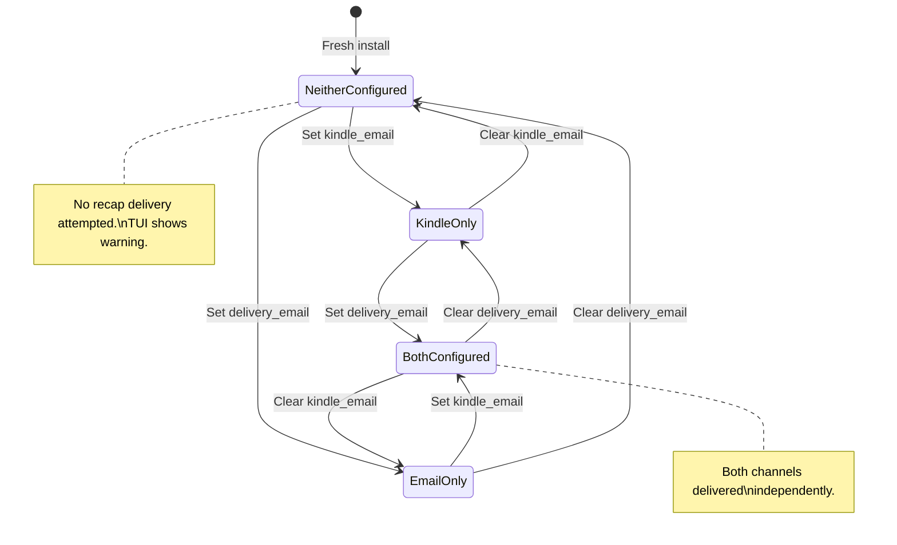
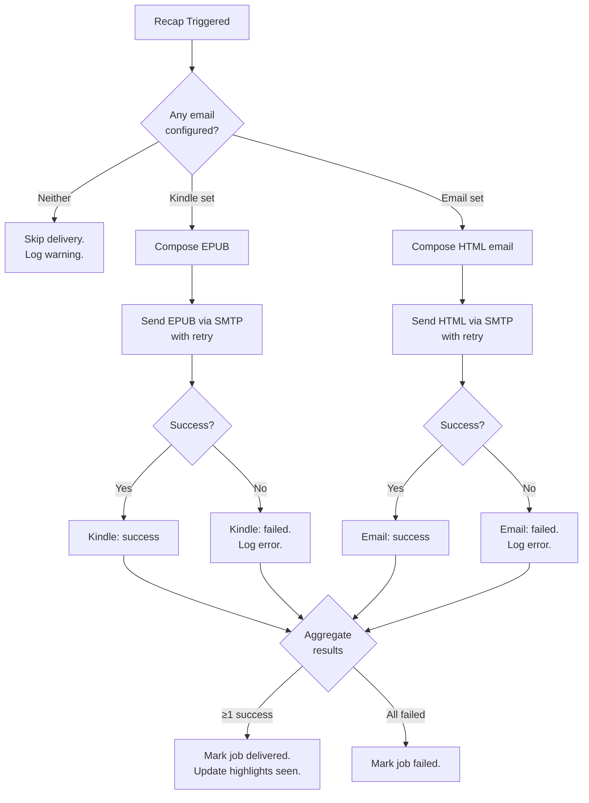

# Data Model: Email Delivery

**Feature**: 009-email-delivery
**Phase**: 1 — Design & Contracts
**Date**: 2026-06-07

---

## Entity Changes

### User (extended)

The existing `users` table gains a `delivery_email` column.

| Column | Type | Constraints | Default | Description |
|--------|------|-------------|---------|-------------|
| `id` | `INTEGER` | `PRIMARY KEY AUTOINCREMENT` | — | Unchanged |
| `kindle_email` | `TEXT` | `NOT NULL` | `''` (empty string) | Unchanged. Send-to-Kindle email for EPUB delivery |
| `delivery_email` | `TEXT` | `NULL` | `NULL` | **New**. Regular email for HTML recap delivery. `NULL` = not configured; empty string `''` = explicitly cleared (treated same as NULL by application logic) |
| `created_at` | `TEXT` | `NOT NULL` | — | Unchanged |

**Application-level semantics**:

- `NULL` or `""` (empty string) → channel inactive.
- Non-empty valid email → channel active.
- Validated by the same regex as `kindle_email` (in `SettingsEndpoints` and `ConfigDeliveryEmailCommand`).

**C# Model** (`src/Relego.Server/Models/User.cs`):

```csharp
public class User
{
    public int Id { get; set; }
    public string KindleEmail { get; set; } = string.Empty;
    public string? DeliveryEmail { get; set; }  // NEW — nullable
    public DateTimeOffset CreatedAt { get; set; }
}
```

**Repository changes** (`UserRepository`):

- `GetByIdAsync`: SELECT now includes `delivery_email AS DeliveryEmail`.
- `EnsureUserAsync`: INSERT includes `delivery_email` with `NULL`.
- New method: `UpdateDeliveryEmailAsync(int userId, string? deliveryEmail)` — sets `delivery_email` to the value (null for clearing).
- `UpdateKindleEmailAsync`: unchanged.

---

### Settings (unchanged)

The `settings` table is **not modified**. Delivery email lives on the `users` table (same as `kindle_email`), consistent with the existing pattern where email addresses are user properties, not settings properties.

---

### Delivery Channels (conceptual, not a DB entity)

Two concrete delivery channels exist in application logic:

| Channel | Key | Email Field | Composer | Output Format | Delivery Method |
|---------|-----|-------------|----------|---------------|-----------------|
| Kindle | `kindle` | `users.kindle_email` | `EpubComposer.Compose()` | EPUB attachment | `IMailDeliveryService.SendRecapAsync()` |
| Email | `email` | `users.delivery_email` | `HtmlEmailComposer.Compose()` | HTML inline (multipart/alternative) | `IMailDeliveryService.SendHtmlRecapAsync()` |

Channel identification in logs: `{Channel = "Kindle"}` / `{Channel = "Email"}`.

---

## Contract Changes

### SettingsResponse (extended)

```csharp
public sealed record SettingsResponse
{
    // ... existing properties unchanged ...
    public string Schedule { get; set; } = string.Empty;
    public string? DeliveryDay { get; set; }
    public string DeliveryTime { get; set; } = string.Empty;
    public int Count { get; set; }
    public string KindleEmail { get; set; } = string.Empty;
    public string Timezone { get; set; } = string.Empty;

    // NEW:
    /// <summary>
    /// Regular (non-Kindle) email address for HTML recap delivery.
    /// null when not configured.
    /// </summary>
    public string? DeliveryEmail { get; set; }
}
```

### UpdateSettingsRequest (extended)

```csharp
public sealed record UpdateSettingsRequest
{
    // ... existing properties unchanged ...
    public string? Schedule { get; set; }
    public string? DeliveryDay { get; set; }
    public string? DeliveryTime { get; set; }
    public int? Count { get; set; }
    public string? KindleEmail { get; set; }
    public string? Timezone { get; set; }

    // NEW:
    /// <summary>
    /// Regular email address for HTML recap delivery.
    /// null = don't change. "" = clear. Valid email = set.
    /// </summary>
    public string? DeliveryEmail { get; set; }
}
```

### StatusResponse (extended)

```csharp
public sealed record StatusResponse
{
    // ... existing properties unchanged ...
    public int TotalHighlights { get; set; }
    public int TotalBooks { get; set; }
    public int TotalAuthors { get; set; }
    public int ExcludedHighlights { get; set; }
    public int ExcludedBooks { get; set; }
    public int ExcludedAuthors { get; set; }
    public string? NextRecap { get; set; }
    public string? LastRecapStatus { get; set; }
    public string? LastRecapError { get; set; }
    public bool KindleEmailConfigured { get; set; }

    // NEW:
    /// <summary>Indicates whether a regular delivery email is configured for the user.</summary>
    public bool DeliveryEmailConfigured { get; set; }
}
```

### TestEmailRequest (new)

```csharp
/// <summary>
/// Optional request body for POST /settings/test-email.
/// </summary>
public sealed record TestEmailRequest
{
    /// <summary>
    /// Channel to test. "kindle", "delivery", or "both".
    /// null = auto-detect (send to all configured channels).
    /// </summary>
    public string? Channel { get; set; }
}
```

### TestEmailResponse (new concept — returned as anonymous object or explicit record)

```csharp
// Single-channel response: { "message": "Test email sent successfully." }
// Multi-channel response: { "results": { "kindle": { "success": true }, "delivery": { "success": true } } }
```

If both channels fail: returns 502 with per-channel error details.

---

## Migration SQL

Run after the main schema DDL in `SchemaBootstrap.ApplyAsync()`:

```sql
-- Fresh install column (included in CREATE TABLE IF NOT EXISTS):
delivery_email TEXT NULL

-- Existing database migration (idempotent via PRAGMA check):
ALTER TABLE users ADD COLUMN delivery_email TEXT NULL;
```

**Migration logic** (C# pseudocode in `SchemaBootstrap`):

```csharp
// After main SchemaSql execution:
var columns = await connection.QueryAsync<(int cid, string name, string type, int notnull, object dflt_value, int pk)>(
    "PRAGMA table_info(users)");
if (!columns.Any(c => c.name == "delivery_email"))
{
    await connection.ExecuteAsync("ALTER TABLE users ADD COLUMN delivery_email TEXT NULL");
}
```

---

## Validation Rules

| Field | Rule | Error Message |
|-------|------|---------------|
| `delivery_email` | If non-null and non-empty: must match email regex `^[A-Z0-9.!#$%&'*+/=?^_`{|}~-]+@[A-Z0-9](?:[A-Z0-9-]{0,61}[A-Z0-9])?(?:\.[A-Z0-9](?:[A-Z0-9-]{0,61}[A-Z0-9])?)+$` | `"Invalid email format."` |
| `delivery_email` | Empty string `""` → clears field (sets to null) | N/A |
| `delivery_email` | Null/missing → no change to existing value | N/A |

Same regex as `kindle_email` (FR-009-21). Shared validation method in `SettingsEndpoints`.

---

## State Transitions

### User Delivery Configuration States



### Recap Delivery Flow (per channel)


