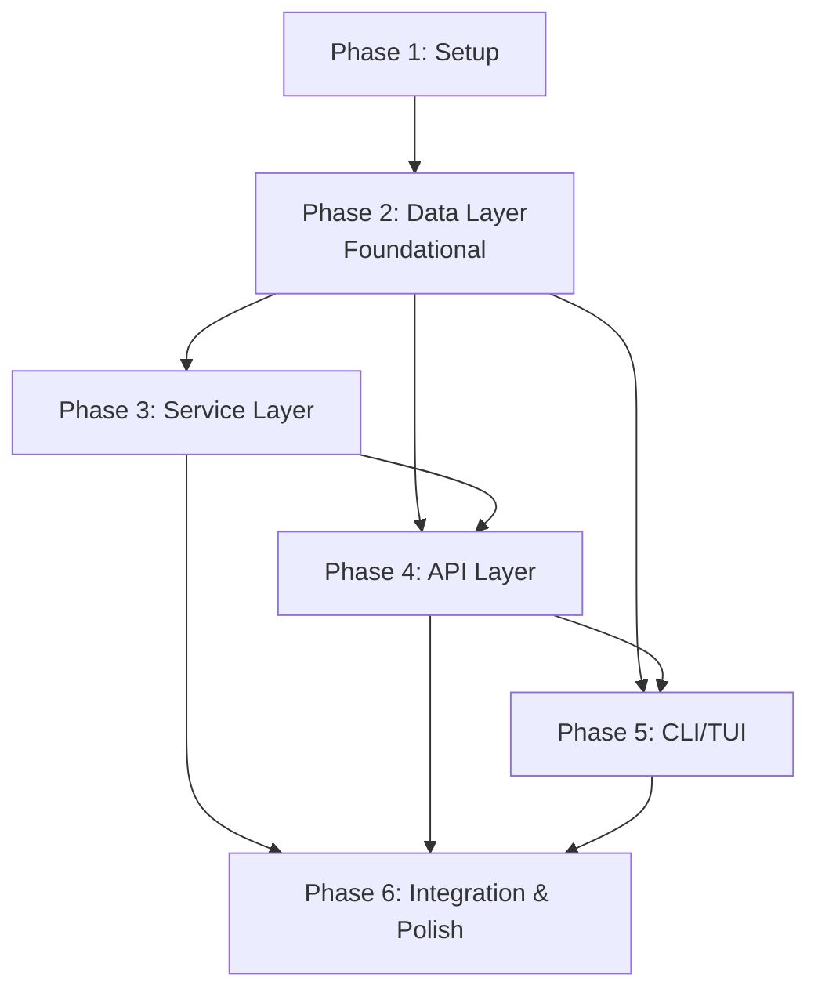

# Tasks: Email Delivery

**Input**: Design documents from `/specs/009-email-delivery/`
**Prerequisites**: plan.md (required), spec.md (required for user stories), research.md, data-model.md, contracts/api.md, quickstart.md

**Tests**: Included — xUnit unit tests for `HtmlEmailComposer`, `RecapService` dual-channel logic, endpoint validation, CLI command validation, per project constitution V ("Tests Ship with Code"). Contract/integration tests for API endpoints. Manual E2E for HTML rendering verification.

**Organization**: Tasks are grouped by user story so each slice stays independently testable after the shared foundation is in place. The plan defines 5 implementation phases: Phase 1 (Setup) verifies current build state, Phase 2 (Foundational / Data Layer) establishes the DB schema, models, and contracts that all user stories depend on, Phase 3 (Service Layer) builds the composable services, Phase 4 (API Layer) wires endpoints, Phase 5 (CLI/TUI) exposes settings to users, and Phase 6 (Integration & Polish) validates end-to-end behavior.

## Format: `[ID] [P?] [Story] Description`

- **[P]**: Can run in parallel (different files, no dependency on an incomplete task)
- **[Story]**: Which user story this task belongs to (`US1`–`US8`)
- All file paths are relative to the repository root

---

## Phase 1: Setup (Prerequisites)

**Purpose**: Verify the current solution builds and tests pass before starting implementation. No new code is written in this phase.

- [ ] T001 Verify `dotnet build src/Relego.slnx` exits 0 with zero errors/warnings across all four projects
- [ ] T002 [P] Verify `dotnet test src/Relego.slnx` exits 0 with no regressions in existing tests

**Checkpoint**: Solution is in a known-good state. Implementation can begin.

---

## Phase 2: Foundational — Data Layer (DB Migration, Models, Contracts)

**Purpose**: Add `delivery_email` column to the database, update the `User` model and `UserRepository`, and extend shared contracts (`SettingsResponse`, `UpdateSettingsRequest`, `StatusResponse`). This phase is the **blocking prerequisite** for all user story phases — no service or API work can begin until the data layer is ready. Covers US1 (Configure Regular Email Delivery) data foundations and US4 (Kindle-Only Mode Preserved) migration safety.

**⚠️ CRITICAL**: T003–T010 must complete before any Service Layer (Phase 3) or API Layer (Phase 4) tasks.

### Database Migration

- [ ] T003 [P] [US1] Modify `src/Relego.Server/Infrastructure/Database/SchemaBootstrap.cs`: (a) update the `CREATE TABLE IF NOT EXISTS users` statement to include `delivery_email TEXT NULL` column for fresh installs, and (b) after the main schema DDL, query `PRAGMA table_info(users)` to check if `delivery_email` column exists; if not, execute `ALTER TABLE users ADD COLUMN delivery_email TEXT NULL`. Use Dapper for the PRAGMA query (consistent with existing `UserRepository` pattern). The migration must be idempotent — running it on a database that already has the column must not error.

### Model & Row Updates

- [ ] T004 [P] [US1] Modify `src/Relego.Server/Models/User.cs`: add `public string? DeliveryEmail { get; set; }` property (nullable, defaults to null). This mirrors the existing `KindleEmail` pattern but uses nullable string to represent "not configured" vs empty string "explicitly cleared."

- [ ] T005 [US1] Modify `src/Relego.Server/Data/UserRepository.cs`:
  - Update `UserRow` to include `DeliveryEmail` column mapping.
  - Update `GetByIdAsync` SQL to select `delivery_email AS DeliveryEmail`.
  - Update `EnsureUserAsync` INSERT to include `delivery_email` column with `NULL` default.
  - Add `Task UpdateDeliveryEmailAsync(int userId, string? deliveryEmail)` method — maps empty string to `NULL`, sets `delivery_email = @DeliveryEmail`.
  - Ensure `UpdateKindleEmailAsync` remains unchanged (backward compatibility per US4).

### Contract Updates (Relego.Core)

- [ ] T006 [P] [US1] Modify `src/Relego.Core/Contracts/SettingsResponse.cs`: add `public string? DeliveryEmail { get; set; }` property (nullable; `null` when not configured). All existing properties remain unchanged. JSON serialization uses `System.Text.Json` — nullable reference types serialize as `null`/absent.

- [ ] T007 [P] [US1] Modify `src/Relego.Core/Contracts/UpdateSettingsRequest.cs`: add `public string? DeliveryEmail { get; set; }` property. Semantics: `null` = don't change existing value; `""` (empty string) = clear the field; non-empty valid email = set. Same pattern as existing `KindleEmail` property.

- [ ] T008 [P] [US1] Modify `src/Relego.Core/Contracts/StatusResponse.cs`: add `public bool DeliveryEmailConfigured { get; set; }` property. `true` when `delivery_email` is a non-empty, non-null string; `false` otherwise. Mirrors existing `KindleEmailConfigured`.

- [ ] T009 [P] [US6] Create `src/Relego.Core/Contracts/TestEmailRequest.cs`: new record `TestEmailRequest` with `public string? Channel { get; set; }` (allowed values: `"kindle"`, `"delivery"`, `"both"`, or `null` for auto-detect). This contract is used by the extended `POST /settings/test-email` endpoint (Phase 4).

### Data Layer Tests

- [ ] T010 [US1] Create `src/Relego.Tests/Api/SettingsDeliveryEmailTests.cs`: test that `GET /settings` returns `deliveryEmail` field (`null` when not set, value when set). Test that `PATCH /settings` with `deliveryEmail` persists correctly. Test that empty string `""` clears the field. Use the ASP.NET Core `WebApplicationFactory<Program>` integration test pattern already established in existing API tests.

**Checkpoint**: `GET /settings` returns `deliveryEmail`. `PATCH /settings` accepts and persists `deliveryEmail`. Database migration runs on startup without errors for fresh and existing databases. Tests pass (`dotnet test --filter "FullyQualifiedName~SettingsDeliveryEmail"`).

---

## Phase 3: Service Layer (HtmlEmailComposer, RecapService Refactor, MailDeliveryService)

**Purpose**: Build the HTML email composer, refactor `RecapService.ExecuteAsync()` for dual-channel delivery with error isolation, and extend `IMailDeliveryService`/`MailDeliveryService`/`DevMailDeliveryService` to support HTML recap delivery. After this phase, the server can compose and deliver HTML recap emails to `delivery_email` (US2, US7), handle dual-channel delivery with error isolation (US3), preserve Kindle-only mode (US4), and support email-only mode (US5).

### HtmlEmailComposer

- [ ] T011 [US7] Create `src/Relego.Server/Services/HtmlEmailComposer.cs`: static class (pattern-matches existing `EpubComposer`) with method `static MimeMessage Compose(IReadOnlyList<SelectionCandidate> highlights, DateTimeOffset recapDate, string cadence, string toAddress, string fromAddress)`. Produces a `MimeMessage` with:
  - **MIME structure**: `multipart/alternative` via MimeKit `BodyBuilder` containing `text/html` and `text/plain` parts.
  - **HTML part**: email-safe inline CSS using `<table>` layout, `max-width: 600px`, system font stack, `viewport` meta tag. Branded header with "Relego" logotype (text-based, using `BrandColors.Light.Accent` hex), recap date, highlights grouped by book (title + author + highlight text with left-border visual treatment), footer with "Sent by Relego" and project URL. No external stylesheets, no JavaScript, no CSS Grid/Flexbox, no `<style>` blocks.
  - **Plain-text part**: text-only formatting — book title underlined with `===`, author on separate line, highlight text indented with `>` prefix.
  - **Edge cases**: empty highlight list produces graceful "No highlights this recap" message; Unicode/emoji characters encoded in UTF-8; very long highlights (2000+ chars) fully included in HTML, truncated at 2000 chars with `[...]` in plain-text part.
  - Reuses `Relego.Core.Branding.BrandColors` for color scheme consistency with EPUB composer.

- [ ] T012 [US7] Write `src/Relego.Tests/Services/HtmlEmailComposerTests.cs`: unit tests for `HtmlEmailComposer.Compose()`. Verify:
  - MIME structure is `multipart/alternative` with exactly two parts.
  - HTML part contains required elements (brand header text "Relego", recap date, book title, author name, highlight text, footer with project URL).
  - Plain-text part is non-empty and contains book/author/highlight text.
  - Empty highlight list produces message with "No highlights" content in both parts.
  - Unicode characters (emoji, non-Latin scripts) are preserved in both HTML and plain-text parts.
  - Multiple books are grouped correctly with books in the HTML output separated.
  - Very long highlight text is truncated in plain-text part but fully present in HTML part.
  - No attachment parts are present (no EPUB, no linked resources).

### MailDeliveryService Extensions

- [ ] T013 [US2] Modify `src/Relego.Server/Services/IMailDeliveryService.cs`: add `Task SendHtmlRecapAsync(MimeMessage message, CancellationToken cancellationToken = default)` method. The method accepts a pre-composed `MimeMessage` (from `HtmlEmailComposer.Compose()`) and sends it via SMTP. This separates concerns: composition is owned by `HtmlEmailComposer`, transport is owned by the delivery service.

- [ ] T014 [US2] Modify `src/Relego.Server/Services/MailDeliveryService.cs`: implement `SendHtmlRecapAsync` — delegates to the existing private `SendEmailAsync(MimeMessage, CancellationToken)` method (which handles SMTP connection, authentication via `SmtpClient`, and sending). No new SMTP configuration or connection logic — reuses the existing infrastructure. Log at `Information` level: `"HTML recap sent to {ToAddress}"`.

- [ ] T015 [US2] Modify `src/Relego.Server/Services/DevMailDeliveryService.cs`: implement `SendHtmlRecapAsync` — mirrors `MailDeliveryService` implementation but uses development SMTP settings (`SecureSocketOptions.None`, no auth, `Smtp__Port` default 25). Delegates to the existing private `SendEmailAsync` method.

### RecapService Dual-Channel Refactor

- [ ] T016 [US2] [US3] [US4] [US5] Modify `src/Relego.Server/Services/RecapService.cs`: refactor `ExecuteAsync` for dual-channel delivery with error isolation. New logic flow:
  1. Fetch user. Check `KindleEmail` (after trimming whitespace) and `DeliveryEmail` (after trimming whitespace). Determine `hasKindle = !string.IsNullOrWhiteSpace(user.KindleEmail)`, `hasEmail = !string.IsNullOrWhiteSpace(user.DeliveryEmail)`.
  2. If NEITHER is set (`!hasKindle && !hasEmail`): log warning `"No delivery channel configured — recaps cannot be delivered"` with structured property `{Channel = "None"}`, mark job failed, return early. No SMTP connections attempted.
  3. Compose EPUB **once** if `hasKindle` (reuse existing `EpubComposer.Compose()` call — unchanged).
  4. Compose HTML MimeMessage **once** if `hasEmail` (new `HtmlEmailComposer.Compose()` call). If composition throws, catch and log, set `hasEmail = false` so SMTP is not attempted, but do NOT abort the Kindle channel.
  5. Launch independent delivery attempts (sequential, not parallel — see ADR-007):
     - **Kindle channel**: if `hasKindle`, send EPUB via `_mailDeliveryService.SendRecapAsync()` wrapped in existing `_retryPolicy.ExecuteAsync()`. Catch all exceptions, log `"Kindle delivery failed"` with exception details, set `kindleOk = false`.
     - **Email channel**: if `hasEmail`, send HTML via `_mailDeliveryService.SendHtmlRecapAsync()` wrapped in a **new, independent** `AsyncRetryPolicy` instance (same retry count/backoff config as Kindle). Catch all exceptions, log `"Email delivery failed"` with exception details, set `emailOk = false`.
  6. Outcome determination:
     - If at least one channel delivered successfully (`kindleOk || emailOk`): mark highlights as seen, mark job as delivered.
     - If both channels failed (and at least one was attempted): mark job as failed.
     - Log per-channel outcomes: `"Kindle delivery: {Result}"`, `"Email delivery: {Result}"` with structured properties `{Channel, Success}`.
  7. **Backward compatibility** (US4): When only `kindle_email` is configured, the flow is identical to current behavior — EPUB composed and sent via existing `SendRecapAsync`. No code path changes for Kindle-only users.

- [ ] T017 [US2] [US3] [US4] [US5] Write `src/Relego.Tests/Services/RecapServiceDualChannelTests.cs`: unit tests using mocked `IMailDeliveryService` (via Moq or manual test doubles). Test all delivery channel combinations:
  - Both emails configured → `SendRecapAsync` called for Kindle AND `SendHtmlRecapAsync` called for Email; both highlights seen and job delivered.
  - Only `kindleEmail` configured → only `SendRecapAsync` called; `SendHtmlRecapAsync` NOT called; job delivered (US4 backward compat).
  - Only `deliveryEmail` configured → only `SendHtmlRecapAsync` called; `SendRecapAsync` NOT called; job delivered (US5 email-only mode).
  - Neither email configured → NO SMTP calls; warning logged; job marked failed.
  - Kindle channel throws SMTP exception → Email channel still proceeds and succeeds → job delivered (US3 isolation).
  - Email channel throws SMTP exception → Kindle channel still proceeds and succeeds → job delivered (US3 isolation).
  - Both channels throw → job marked failed; both errors logged.
  - `HtmlEmailComposer.Compose()` throws → Kindle channel still succeeds; job delivered.
  - `EpubComposer.Compose()` throws → Email channel still succeeds (if configured); job delivered.
  - Empty recap (zero highlights selected) → no emails sent to either channel (existing behavior preserved).

**Checkpoint**: Recap execution with both channels configured sends EPUB to Kindle address and HTML to delivery address. Failure in one channel does not block the other. Single-channel (Kindle-only or Email-only) works. No emails configured → skip with warning. All `RecapServiceDualChannelTests` and `HtmlEmailComposerTests` pass.

---

## Phase 4: API Layer (SettingsEndpoints, StatusEndpoints, Test-Email Channel)

**Purpose**: Update `PATCH /settings` and `GET /settings` to handle `delivery_email`, extend `POST /settings/test-email` with channel parameter, and update `GET /status` to expose delivery email configuration status. Covers US1 (settings persistence), US5 (email-only config validation), and US6 (test email channel selection).

### Settings Endpoints

- [ ] T018 [US1] Modify `src/Relego.Server/Endpoints/SettingsEndpoints.cs` — `GET /settings` and `PATCH /settings`:
  - **GET**: In `ToSettingsResponse(User user)`, set `DeliveryEmail = user.DeliveryEmail` (already added in Phase 2 contracts). No other changes to the GET handler.
  - **PATCH**: In the update handler, extract `request.DeliveryEmail`:
    - If `request.DeliveryEmail` is not null: trim whitespace. If resulting string is empty → normalize to `null` (clears field). If non-empty → validate email format using the **same regex** as `kindleEmail` validation (extract to shared `ValidateEmailFormat(string? email)` helper method). If invalid → return 422 with `{"errors": {"deliveryEmail": ["Invalid email format."]}}`.
    - If `request.DeliveryEmail` is null → no change to existing value (don't touch the field).
  - After validation, call `await userRepo.UpdateDeliveryEmailAsync(user.Id, normalizedDeliveryEmail)`.
  - **Backward compatibility**: `PATCH /settings` without a `deliveryEmail` field (null/missing) does NOT clear an existing `delivery_email`. Existing `kindleEmail` handling is unchanged.

- [ ] T019 [US6] Modify `src/Relego.Server/Endpoints/SettingsEndpoints.cs` — `POST /settings/test-email`:
  - Accept an **optional** JSON request body deserialized as `TestEmailRequest` (from Phase 2). If no body or null `Channel`, default to auto-detect.
  - **Channel auto-detect logic**: query user. If both `kindleEmail` and `deliveryEmail` configured → `both`; if only one → that channel; if neither → return 422 `{"errors": {"channel": ["No delivery email configured."]}}`.
  - **`"kindle"` channel**: if `kindleEmail` not configured → 422. Otherwise, call existing `SendTestEmailAsync(user.KindleEmail)`. Return `{"message": "Test email sent successfully to {kindleEmail}."}`.
  - **`"delivery"` channel**: if `deliveryEmail` not configured → 422. Otherwise, compose a plain-text `MimeMessage` (subject: "Relego - Test Email", body: plain text confirming this is a test from Relego), call `SendHtmlRecapAsync(message)`. Return `{"message": "Test email sent successfully to {deliveryEmail}."}`.
  - **`"both"` channel**: send to both independently (try-catch per channel). Return `{"results": {"kindle": {"success": true|false, "error?": "..."}, "delivery": {"success": true|false, "error?": "..."}}}`. If BOTH fail, return 502 with per-channel details.
  - **Invalid channel value** (not `"kindle"`, `"delivery"`, `"both"`, or null): return 422 `{"errors": {"channel": ["Channel must be 'kindle', 'delivery', or 'both'."]}}`.
  - **Backward compatibility**: Existing callers sending `POST /settings/test-email` with no body continue to work — auto-detect sends to all configured channels, matching the old behavior for Kindle-only users.

### Status Endpoint

- [ ] T020 [US1] Modify `src/Relego.Server/Endpoints/StatusEndpoints.cs`: in the status handler (which maps `StatusResponse`), set `status.DeliveryEmailConfigured = !string.IsNullOrWhiteSpace(user.DeliveryEmail)`. The existing `KindleEmailConfigured` logic is unchanged. No other status fields change.

### API Layer Tests

- [ ] T021 [US1] [US6] Extend `src/Relego.Tests/Api/SettingsDeliveryEmailTests.cs` (created in Phase 2) with additional test cases:
  - `PATCH /settings` with invalid `deliveryEmail` format (e.g., `"not-an-email"`) → 422 with `{"errors": {"deliveryEmail": ["Invalid email format."]}}`.
  - `PATCH /settings` with empty string `""` → clears `deliveryEmail`; subsequent `GET /settings` returns `deliveryEmail: null`.
  - `PATCH /settings` with `deliveryEmail: null` (JSON `null` or field absent) → existing value unchanged.
  - `POST /settings/test-email` with `{"channel": "delivery"}` → calls delivery path; 200 with message containing delivery email.
  - `POST /settings/test-email` with `{"channel": "both"}` → 200 with `results.kindle` and `results.delivery` objects.
  - `POST /settings/test-email` with `{"channel": "delivery"}` when `deliveryEmail` not configured → 422 with actionable error.
  - `POST /settings/test-email` with `{"channel": "invalid"}` → 422 with validation error.
  - `GET /status` returns `deliveryEmailConfigured: true` when `deliveryEmail` is set; `false` when null/empty.

**Checkpoint**: `PATCH /settings` validates and persists `deliveryEmail`. `GET /settings` returns it. `POST /settings/test-email` supports channel selection with proper error handling. `GET /status` exposes `deliveryEmailConfigured`. All API tests pass.

---

## Phase 5: CLI/TUI Layer (Config Commands, TUI Settings & Warnings)

**Purpose**: Add `delivery-email` CLI command, update `config show` and `status` commands, add "Delivery email" field to TUI settings screen, and update TUI warning logic to check both email fields. Covers US8 (CLI/TUI Settings Management) end-to-end.

### CLI Commands

- [ ] T022 [US8] Create `src/Relego.Cli/Commands/Config/ConfigDeliveryEmailCommand.cs`: Spectre.Console.Cli command invoked as `relego config delivery-email <address>`. Behavior:
  - Validates `<address>` with the same email regex used server-side (`ConfigKindleEmailCommand` pattern). If invalid, display `[red]Invalid email format.[/]` and return non-zero exit code.
  - Sends `PATCH /settings` with `{"deliveryEmail": "<address>"}` via `SunnyHttpClient.PatchSettingsAsync()` (or equivalent existing method).
  - `<address>` can be empty string `""` to clear the field.
  - On success: `[green]Delivery email set to {address}.[/]` (or `[green]Delivery email cleared.[/]` for empty).
  - On server error: display error message from API response.
  - Inherit from `Spectre.Console.Cli.AsyncCommand<ConfigDeliveryEmailCommand.Settings>` (pattern-match `ConfigKindleEmailCommand`).

- [ ] T023 [US8] Modify `src/Relego.Cli/Program.cs`: register `ConfigDeliveryEmailCommand` in the `config` command branch alongside `ConfigKindleEmailCommand`. Follow the existing Spectre.Console.Cli command registration convention used for `ConfigKindleEmailCommand`.

- [ ] T024 [US8] Modify `src/Relego.Cli/Commands/Config/ConfigShowCommand.cs`: after the existing `kindleEmail` row, add `table.AddRow("Delivery Email", response.DeliveryEmail ?? "[grey](not set)[/]");`. Use the same Spectre.Console `Table` formatting pattern as the existing `kindleEmail` row.

- [ ] T025 [US8] Modify `src/Relego.Cli/Commands/StatusCommand.cs`:
  - Add `table.AddRow("Delivery Email", FormatDeliveryEmail(response.DeliveryEmailConfigured));` after the existing `KindleEmail` row.
  - Add private helper `static string FormatDeliveryEmail(bool configured) => configured ? "[green]Configured[/]" : "[grey]Not configured[/]";` — mirroring the existing `FormatKindleEmail` pattern.

### TUI Updates

- [ ] T026 [US8] Modify `src/Relego.Cli/Tui/SettingsScreen.cs`:
  - Add a `SettingsField` for `"Delivery Email"` with value `_settings.DeliveryEmail ?? ""`, field key `"deliveryEmail"`, and `FieldKind.Editable`. Place it immediately after the existing `"Kindle Email"` field.
  - Extend the save logic: when the user saves, include `deliveryEmail` in the `UpdateSettingsRequest` sent to `PATCH /settings`. Use the same validation rules (email format, empty string → clear).
  - The field must render and behave identically to the existing `"Kindle Email"` field — same edit mode, same validation UX.

- [ ] T027 [US8] Modify `src/Relego.Cli/Tui/StatusChrome.cs`:
  - In `RefreshAsync`: after fetching status from the server, compute a new `AnyEmailConfigured` property: `_status.KindleEmailConfigured || _status.DeliveryEmailConfigured`.
  - In `UpdateLabels` (or equivalent render method):
    - Change the warning condition from `!_status.KindleEmailConfigured` to `!AnyEmailConfigured`.
    - Change the warning text from the Kindle-specific message to: `"⚠ No delivery email configured — recaps cannot be delivered."` (per FR-009-20).
    - Ensure the warning is displayed with the same yellow/dim styling as the existing warning.

### CLI/TUI Tests

- [ ] T028 [US8] Write `src/Relego.Tests/Cli/ConfigDeliveryEmailTests.cs`: unit tests for `ConfigDeliveryEmailCommand`:
  - Valid email → sends correct `PATCH /settings` body; success output contains "Delivery email set to".
  - Invalid email format → validation error message; no HTTP call made.
  - Empty string → sends `{"deliveryEmail": ""}`; output contains "Delivery email cleared".
  - Server returns error (e.g., 422) → error message displayed.
  - Use a mock/test `SunnyHttpClient` or `IRelegoHttpClient` to verify the HTTP request body without a real server.

**Checkpoint**: `relego config delivery-email user@example.com` sets the delivery email. `relego config show` displays both emails. `relego status` shows delivery email status. TUI settings page has "Delivery email" field. TUI warning shows only when NEITHER email is configured. Tests pass (`dotnet test --filter "FullyQualifiedName~ConfigDeliveryEmail"`).

---

## Phase 6: Integration Testing & Polish

**Purpose**: End-to-end validation, edge case verification, backward compatibility confirmation, and documentation updates. Covers all user stories in integration.

### E2E Testing with smtp4dev

- [ ] T029 [US2] [US3] [US7] Manual E2E test per `quickstart.md`:
  1. Start server + smtp4dev (see quickstart step 1).
  2. Configure both `kindle_email` (e.g., `kindle@test.local`) and `delivery_email` (e.g., `html@test.local`) via `PATCH /settings`.
  3. Import test highlights via `POST /highlights/import` with `examples/kindle-highlights.txt` content.
  4. Trigger recap via `POST /recaps`.
  5. Open smtp4dev web UI at `http://localhost:5000`.
  6. **Verify**: Two emails appear — one to `kindle@test.local` with EPUB attachment (`.epub` file), one to `html@test.local` with HTML body inline (multipart/alternative MIME, highlights grouped by book, branded header/footer).
  7. Inspect HTML email raw source: confirm `Content-Type: multipart/alternative`, both `text/html` and `text/plain` parts present, inline CSS only, no `Content-Disposition: attachment`.

### Edge Case Verification

- [ ] T030 [US3] [US4] [US5] Verify edge cases from spec.md section "Edge Cases":
  - **Neither email configured**: clear both emails, trigger recap → server logs `"No delivery channel configured"`, no email in smtp4dev.
  - **SMTP failure isolation**: stop smtp4dev container (`docker compose stop smtp4dev`), configure both emails, trigger recap → both channels log failure independently. Restart smtp4dev, configure only one email, trigger recap → other channel succeeds.
  - **Empty recap (zero highlights)**: trigger recap with no un-sent highlights → no email to either channel; job completes without SMTP attempts.
  - **`delivery_email` set to `@kindle.com` address**: sends HTML email (not EPUB) — Kindle channel remains the only EPUB path.
  - **Unicode/emoji in highlights**: import highlights with non-Latin characters and emoji, trigger recap → characters preserved in both HTML and plain-text parts (verified in smtp4dev source view).
  - **Very long highlight text** (>2000 chars): verify plain-text part truncates with `[...]` and HTML part includes full text.

### HTML Email Rendering Verification

- [ ] T031 [US7] Manual HTML email rendering verification:
  1. Configure a real SMTP server (e.g., Mailtrap) to send to real inboxes.
  2. Send a recap email with multiple books and highlights.
  3. Verify rendering in:
     - **Gmail (web)**: HTML renders inline, responsive on narrow viewport, images blocked → text readable.
     - **Outlook desktop (Windows, if available)**: table layout renders correctly, no broken layout, brand colors visible.
     - **Apple Mail / iOS Mail (if available)**: responsive layout, brand colors, text readable.
  4. Verify mobile rendering at 320px width: no horizontal scroll, highlights readable, book grouping visible.
  5. If real client testing is not possible, verify against [Litmus](https://www.litmus.com/) or [Email on Acid](https://www.emailonacid.com/) test results (screenshots acceptable for MVP).

### Backward Compatibility Validation

- [ ] T032 [US4] Verify backward compatibility:
  1. Start with an existing database that has `kindle_email` set and **no** `delivery_email` column (simulate pre-migration state by manually dropping the column in sqlite3, or use a pre-existing test database).
  2. Start the server → auto-migration adds `delivery_email` column without errors.
  3. Verify `kindle_email` value is preserved (`GET /settings` returns the original `kindleEmail`).
  4. Trigger recap → EPUB sent to Kindle address (identical to pre-upgrade behavior).
  5. Verify `GET /settings` returns `deliveryEmail: null`.
  6. Existing CLI commands (`relego config kindle-email`, `relego config show`, `relego status`) work unchanged.

### Documentation

- [ ] T033 [P] Update `docs/ARCHITECTURE.md`: add section on `HtmlEmailComposer` service and dual-channel delivery flow. Include a Mermaid sequence diagram showing:
  - `RecapService.ExecuteAsync()` flow: check channels → compose EPUB (if Kindle) → compose HTML (if Delivery) → send independently → mark job outcome.
  - Channel independence: Kindle failure → Email proceeds; Email failure → Kindle proceeds.

- [ ] T034 [P] Verify full test suite: `dotnet test src/Relego.slnx` passes with zero failures and zero warnings. New tests for HtmlEmailComposer, RecapServiceDualChannel, SettingsDeliveryEmail, ConfigDeliveryEmail all included in the run.

**Checkpoint**: Feature complete. All acceptance scenarios from spec.md validated. Backward compatibility confirmed. Architecture docs updated. Full test suite green.

---

## Dependencies & Execution Order

### Phase Dependencies



### User Story Dependencies

- **US1 (Configure Email, P1)**: Depends on Phase 2 (Data Layer). Services in Phase 3/4, CLI in Phase 5.
- **US7 (HTML Composition, P1)**: Depends on Phase 2 (Data Layer). Implemented in Phase 3. **No dependency on US1** — the composer is stateless.
- **US2 (Receive HTML Recap, P1)**: Depends on US7 (composer) and US1 (email field). Implemented in Phase 3/4.
- **US4 (Kindle-Only Preserved, P1)**: Built into Phase 2 migration + Phase 3 RecapService refactor. No separate phase — verified in Phase 6.
- **US5 (Email-Only Mode, P1)**: Built into Phase 3 RecapService refactor + Phase 4 API validation. No separate phase — verified in Phase 6.
- **US3 (Dual-Channel, P2)**: Depends on US2 + US4 + US5. Built into Phase 3 RecapService refactor. Verified in Phase 6.
- **US6 (Test Email Channel, P2)**: Depends on US1 (email field) + US2 (delivery service). Implemented in Phase 4.
- **US8 (CLI/TUI Settings, P2)**: Depends on US1 (API endpoints). Implemented in Phase 5. **Can start in parallel with Phase 3** (Service Layer) since CLI work only needs the contracts from Phase 2 — just needs Phase 4 API to be complete before integration testing.

### Parallel Opportunities

- **Within Phase 2**: T003 (SchemaBootstrap), T004 (User model), T006–T009 (all contracts) can run in parallel — different files, no inter-dependencies. T010 (tests) can start after T006–T008 are done.
- **Within Phase 3**: T011 (HtmlEmailComposer) and T012 (tests) are a pair. T013–T015 (MailDeliveryService) can run in parallel with T011. T016 (RecapService refactor) must wait for T011–T015 completion. T017 (tests) follows T016.
- **Across Phases**: Phase 3 (Service Layer) and Phase 5 (CLI/TUI) can start in parallel after Phase 2 completes — they touch different assemblies (`Relego.Server` vs `Relego.Cli`). Only Phase 4 (API Layer) needs Phase 3 services first.
- **Within Phase 4**: T018 (Settings endpoints), T019 (test-email), T020 (Status) all touch `SettingsEndpoints.cs`/`StatusEndpoints.cs` → sequential within those files, but T020 is independent of T018/T019.
- **Within Phase 5**: T022 (ConfigDeliveryEmailCommand), T024 (ConfigShowCommand), T025 (StatusCommand) are independent files → parallel. T026 (TUI SettingsScreen) and T027 (StatusChrome) are independent → parallel.
- **Within Phase 6**: T029–T032 (manual verification) can run in any order. T033 (docs) and T034 (test suite) are independent → parallel.

### Parallel Example: After Phase 2 Completes

```text
Phase 2 ──┬──► Phase 3 (T011⋯T017) ──► Phase 4 (T018⋯T021)
           │
           └──► Phase 5 (T022⋯T028) ──────────────┘
                                                    │
                                           Phase 6 (T029⋯T034)
```

---

## Implementation Strategy

### Incremental Delivery

1. **Phase 1 (Setup)**: Verify build — ~5 min.
2. **Phase 2 (Data Layer)**: DB migration + models + contracts — foundational, must complete first. ~1-2 hours.
3. **Phase 3 (Service Layer)**: HtmlEmailComposer + RecapService refactor. ~3-4 hours. After this, the server can deliver HTML recaps if `delivery_email` is manually set in the DB.
4. **Phase 4 (API Layer)**: Wire endpoints. ~1-2 hours. After this, API consumers can set/read `delivery_email`.
5. **Phase 5 (CLI/TUI)**: User-facing configuration. ~2-3 hours. After this, feature is fully usable by end users.
6. **Phase 6 (Integration & Polish)**: E2E verification + docs. ~2-3 hours.

### Suggested MVP Scope

The smallest shippable increment with user-visible value is **Phase 1 + Phase 2 + Phase 3 + Phase 4** — after Phase 4, a user can:

- Configure `delivery_email` via `curl PATCH /settings`
- Receive HTML recap emails to their regular inbox
- Send test emails to verify SMTP
- Existing Kindle-only users are unaffected

CLI/TUI integration (Phase 5) and integration testing (Phase 6) add polish but the core server-side delivery is functional after Phase 4.

### Test Categories

| Category | Task IDs | Scope |
|----------|----------|-------|
| Unit — HtmlEmailComposer | T012 | HTML structure, MIME, Unicode, edge cases |
| Unit — RecapService | T017 | Dual-channel logic, error isolation, skip logic |
| Integration — API | T010, T021 | Settings CRUD, test-email, status |
| Unit — CLI | T028 | Config command validation, HTTP mock |
| Manual E2E | T029, T030, T031, T032 | smtp4dev, edge cases, rendering, backward compat |

---

## Notes

- All tasks follow the checklist format: `- [ ] [TaskID] [P?] [Story?] Description with exact file path`.
- Task IDs T001–T034 are sequential in execution order within each phase.
- `[P]` marker on a task means it can be done in parallel with other `[P]` tasks in the same phase.
- `[Story]` labels map to user stories in `spec.md`: US1=Configure Email, US2=Receive HTML Recap, US3=Dual-Channel, US4=Kindle-Only Preserved, US5=Email-Only Mode, US6=Test Email Channel, US7=HTML Composition, US8=CLI/TUI Settings.
- No new NuGet packages required — MimeKit already handles all MIME composition needs.
- No new .NET projects — all changes are within existing `Relego.Core`, `Relego.Server`, `Relego.Cli`, `Relego.Tests`.
- The `tasks.md` file lives at `specs/009-email-delivery/tasks.md` and should be updated with `[X]` checkmarks as tasks are completed on the feature branch.
