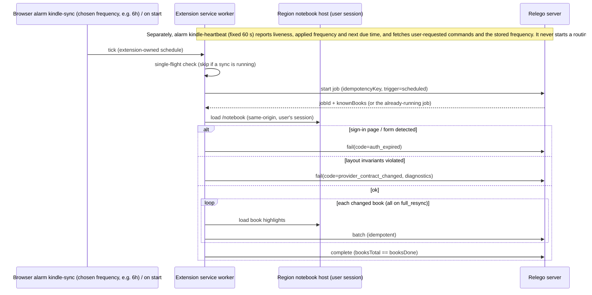

# Contract: Browser Extension ↔ Kindle Notebook (parse profile)

**Spec**: FR-002, FR-003, FR-007, FR-008 | **Research**: R1, R3, R6, R9

## Permissions (Manifest V3, Chrome & Firefox)

- `storage`, `alarms` (two named alarms: `kindle-sync` at the chosen frequency and `kindle-heartbeat` fixed at 60 s)
- `host_permissions`: none granted at install
- `optional_host_permissions`: the selected region's notebook host (allowlist only: `read.amazon.com`, `read.amazon.ca`, `read.amazon.co.uk`, `lesen.amazon.de`, `lire.amazon.fr`, `leggi.amazon.it`, `leer.amazon.es`, `ler.amazon.com.br`) and the user's Relego server origin, requested at runtime; the previous region's host permission is released on region change
- No `cookies`, `webRequest`, `tabs`-wide, or `<all_urls>` permission. The extension never reads or
  exports cookies; page HTML never leaves the browser.

## Sync flow (in the user's browser)

Amazon authentication, CAPTCHA, and MFA are completed **by the user on Amazon's page**; when
sign-in is needed the extension opens the notebook tab and waits. It never fills credentials.

## Parse-profile invariants (checked every run)

1. Notebook container and library list present.
2. Library non-empty ⇒ ≥ 1 book parsed; each book has a title.
3. Each highlight has non-empty text.
4. Export-limit warning element → `truncated = true` for that book (never an error).
5. Unrecognized required structure ⇒ `provider_contract_changed` (code + selector id + counts only).

## Failure codes → user recovery (surfaced in the web UI)

| Code | Meaning | Recovery steps shown |
|------|---------|----------------------|
| `auth_expired` | Notebook redirected to Amazon sign-in | Open the Kindle notebook in this browser and sign in on Amazon; sync resumes automatically |
| `provider_contract_changed` | Page layout no longer matches profile | Update the extension; meanwhile use local My Clippings/Kobo import; report the diagnostics |
| `network` | Amazon or server unreachable | Check connectivity; the next cycle retries without duplicates |
| `server_rejected` | Relego rejected a batch | Check server version/logs; retry or run full resync |
| `interrupted` | Browser closed mid-run | Keep the browser open; retry (idempotent) |

## Tests

Committed HTML fixtures under `src/relego.extension/tests/fixtures/<regionId>/` (library list, book
page, truncation warning, sign-in redirect, changed layout, empty) for each allowlisted region. A
fixture update requires a profile version bump. Extension tests also cover: picker lists exactly the
allowlist, permission requested only for the selected host, denial leaves state unchanged, the `kindle-sync`
alarm period equals each of the ten frequencies and is re-created on startup/frequency change, the
`kindle-heartbeat` period stays 60 s for all ten, the heartbeat never starts a sync, and overdue or
overlapping alarm firings produce at most one sync.
