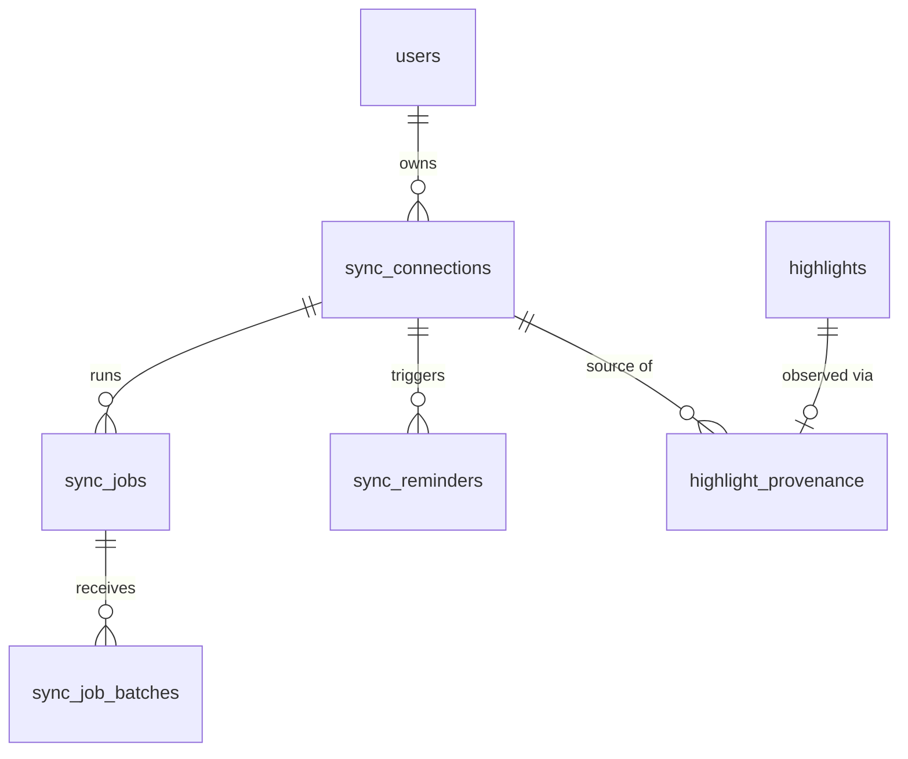
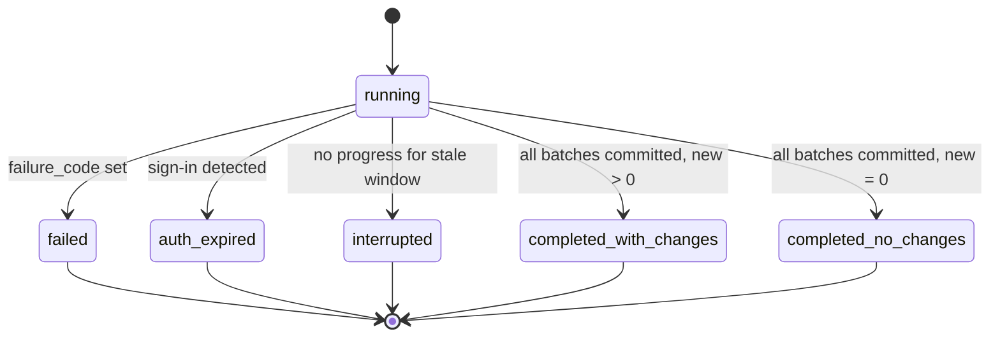

# Data Model: Kindle Background Synchronization

**Spec**: [spec.md](spec.md) | **Research**: [research.md](research.md)

Storage: SQLite (`/data/relego.db`), created idempotently in `SchemaBootstrap` (existing
`CREATE TABLE IF NOT EXISTS` pattern). **No existing table is altered**; legacy rows stay valid
(FR-015). Every new table carries `user_id` (FR-014). Timestamps are ISO-8601 UTC text, as today.

## Entity map

## `sync_connections` — Kindle Cloud Connection

| Column | Type | Notes |
|--------|------|-------|
| id | INTEGER PK | |
| user_id | INTEGER NOT NULL → users | ownership boundary |
| provider_id | TEXT NOT NULL | `SourceDescriptor.Id`, e.g. `kindle-cloud`; never an enum |
| token_hash | TEXT NOT NULL | SHA-256 of pairing token; the token itself is shown once, never stored |
| state | TEXT NOT NULL | `pending_pairing` \| `active` \| `auth_expired` \| `disconnected` |
| disclosure_version | TEXT NOT NULL | provider disclosure version shown at setup |
| profile_version | TEXT NULL | parse-profile version last reported by the extension |
| region_id | TEXT NULL | allowlisted region ID (`us` \| `ca` \| `uk` \| `de` \| `fr` \| `it` \| `es` \| `br`); NULL until the extension pairs; validated server-side against the provider's region profiles, never a client-supplied host. The notebook host is **derived** from the profile, not stored |
| region_changed_at | TEXT NULL | last region change (drives forced `full_resync` and status text) |
| sync_interval_minutes | INTEGER NOT NULL DEFAULT 360 | one of `15,30,45,60,120,240,360,720,1080,1440` (CHECK-constrained and validated by the provider); stored and returned only — the **extension** turns it into its `kindle-sync` alarm period; no server schedule is derived from it |
| schedule_updated_at | TEXT NULL | last frequency change |
| applied_interval_minutes | INTEGER NULL | frequency the extension last reported as applied to its sync alarm (heartbeat); NULL until reported; display-only |
| next_sync_due_at | TEXT NULL | next due time of the extension's sync alarm as last reported in a heartbeat; **display-only**, never used to trigger work |
| pending_command | TEXT NULL | `sync` \| `full_resync` \| NULL; **at most one**; set only by user action (Sync now / Full resync / retry) or region change, consumed on heartbeat; `sync` never overwrites `full_resync`. Routine syncs never set it |
| connected_at | TEXT NULL | first successful pairing |
| last_heartbeat_at | TEXT NULL | extension liveness (FR-012) |
| last_sync_started_at / last_sync_completed_at | TEXT NULL | |
| last_new_content_at | TEXT NULL | drives the inactivity reminder |
| last_auth_expired_at | TEXT NULL | |
| created_at | TEXT NOT NULL | |

Constraints: `UNIQUE(user_id, provider_id) WHERE state <> 'disconnected'` (partial index) so one
live connection per provider per owner; reconnecting after disconnect creates a new row.
Stores **no** Amazon identifier, password, cookie, or session token.

## `sync_jobs` — Sync Job

| Column | Type | Notes |
|--------|------|-------|
| id | INTEGER PK | |
| connection_id | INTEGER NOT NULL → sync_connections | |
| user_id | INTEGER NOT NULL → users | |
| idempotency_key | TEXT NOT NULL | client-generated; `UNIQUE(user_id, idempotency_key)` |
| mode | TEXT NOT NULL | `routine` \| `full_resync` |
| trigger | TEXT NOT NULL | `scheduled` (extension sync alarm) \| `manual` \| `initial` \| `retry` \| `region_change` |
| status | TEXT NOT NULL | see state machine |
| phase | TEXT NULL | `discovering` \| `reading` \| `uploading` \| `done` |
| books_total / books_done | INTEGER NULL | progress (FR-005a) |
| highlights_seen / highlights_new / highlights_duplicate | INTEGER NOT NULL DEFAULT 0 | |
| truncated_books | INTEGER NOT NULL DEFAULT 0 | books where the export-limit warning was seen |
| failure_code | TEXT NULL | `auth_expired` \| `provider_contract_changed` \| `network` \| `server_rejected` \| `interrupted` |
| failure_detail | TEXT NULL | sanitized (no page content, no secrets) |
| recovery_steps | TEXT NULL | JSON array of strings (FR-007, SC-008) |
| started_at / ended_at | TEXT | |

### Job state machine

A job is never `completed_*` unless the extension sent an explicit completion carrying
`books_total == books_done`; otherwise it ends `failed`/`interrupted` (no silent success, SC-002).

## `sync_job_batches` — idempotent upload record

| Column | Type | Notes |
|--------|------|-------|
| job_id | INTEGER → sync_jobs | |
| batch_index | INTEGER | `PRIMARY KEY(job_id, batch_index)` |
| new_highlights / duplicate_highlights / new_books / new_authors | INTEGER | stored `SyncResponse` so a replayed batch returns the original counts |
| received_at | TEXT | |

## `highlight_provenance` — Import Record provenance

| Column | Type | Notes |
|--------|------|-------|
| highlight_id | INTEGER PK → highlights | one provenance row per highlight per source |
| connection_id | INTEGER NULL → sync_connections | |
| source_id | TEXT NOT NULL | `kindle-cloud` |
| region_id | TEXT NULL | region the highlight was observed in; NULL for none |
| external_id | TEXT NULL | provider-stable id if the notebook exposes one; unknown stays NULL |
| truncated | INTEGER NOT NULL DEFAULT 0 | export-limit truncation observed |
| location / note / color | TEXT NULL | unknown remains NULL (FR-015) |
| first_seen_at / last_seen_at | TEXT | |

Index: `UNIQUE(source_id, region_id, external_id) WHERE external_id IS NOT NULL` (re-observation by
external id within a region is matched before text dedup; identifiers are not assumed comparable
across regional catalogs). Legacy highlights have no provenance row and are unaffected.
The canonical dedup remains `uq_highlights_user_book_text`; this table never replaces or deletes
highlights.

## `sync_reminders` — Sync Reminder

| Column | Type | Notes |
|--------|------|-------|
| id | INTEGER PK | |
| connection_id / user_id | INTEGER NOT NULL | |
| quiet_since | TEXT NOT NULL | start of the quiet period this reminder covers |
| threshold_days | INTEGER NOT NULL | 45 (provider-declared) |
| created_at | TEXT NOT NULL | |
| emailed_at | TEXT NULL | NULL when no email configured/failed |
| dismissed_at / resolved_at | TEXT NULL | resolved when new content syncs |

`UNIQUE(connection_id, quiet_since)` prevents repeat reminders for the same quiet period.

## Derived: Kindle Region (not a table)

Static, versioned allowlist in the provider's `ParseProfile` (see
[contracts/extension-notebook-profile.md](contracts/extension-notebook-profile.md)):
`{ id, displayName, notebookHost, signInHostPatterns }` for `us` (`read.amazon.com`), `ca`
(`read.amazon.ca`), `uk` (`read.amazon.co.uk`), `de` (`lesen.amazon.de`), `fr` (`lire.amazon.fr`),
`it` (`leggi.amazon.it`), `es` (`leer.amazon.es`), `br` (`ler.amazon.com.br`). `jp`/`cn`
(documented incompatible) and `dk`/`ie`/`pl` (no dedicated notebook host validated) are **not**
entries. `sync_connections.region_id` references an entry by ID;
removing an entry from a later profile makes the connection `auth_expired`-style "region no longer
supported" failure with recovery steps, never a silent change of host.

## Derived: Extension Sync Schedule (lives in the browser, not a table of ours)

Authoritative stored value: `sync_connections.sync_interval_minutes`. The extension holds two alarms:
`kindle-sync` (period = that value; owns routine sync timing) and `kindle-heartbeat` (fixed 60 s;
liveness/command pickup only). The server keeps only the display-only reports
`applied_interval_minutes` and `next_sync_due_at`. **There is no server-side routine schedule and no
Quartz trigger for sync**; the only Quartz job for this feature is the daily reminder job
(`sync_reminders`). `schedule.applied` = `applied_interval_minutes == sync_interval_minutes`.

## Derived: Sync Status (user-visible)

Computed, not stored: `not_connected` → `awaiting_pairing` → `connected` (idle) → `syncing`;
terminal/attention states `completed`, `auth_expired`, `failed`, `browser_not_reporting`
(no heartbeat for the fixed 5-minute staleness window = 5 heartbeats; independent of sync frequency),
`reminder_due`. Precedence: `auth_expired` > `failed` >
`browser_not_reporting` > `reminder_due` > `syncing` > `completed` > `connected`.

## Derived: Coverage Disclosure

Not a table. Static, versioned content owned by `ICloudSyncProvider` (see
[contracts/cloud-sync-provider.md](contracts/cloud-sync-provider.md)); `disclosure_version` on the
connection records what the user saw. Failure Report is the `failure_code` /
`failure_detail` / `recovery_steps` triple on `sync_jobs`.

## Validation rules

- Highlight `text` required, trimmed, 1–20,000 chars; book `title` 1–1,000; author ≤ 500.
- Batch ≤ 1,000 highlights; request ≤ 2 MB; `batch_index` ≥ 0 and unique per job.
- `job.mode = full_resync` only valid when connection is `active`.
- Unknown/optional fields are persisted as NULL, never as empty-string placeholders.
- `disconnected` connection tokens are rejected; imported highlights are retained.
- `region_id` ∈ provider region allowlist (eight IDs), else 422 (message lists supported IDs);
  host-shaped input (`://`, `.`, `/`) is rejected as an unknown ID; `jp`/`cn` (incompatible) and
  `dk`/`ie`/`pl` (no validated dedicated host) are explicitly unsupported.
- `sync_interval_minutes` ∈ {15, 30, 45, 60, 120, 240, 360, 720, 1080, 1440}, else 422 listing the
  allowed values; the stored value is unchanged on rejection.
- Region change: running job → `interrupted`; `pending_command` := `full_resync`; highlights,
  books, authors untouched; connection id, token and interval unchanged.
- Job start with `trigger = scheduled` (extension alarm): accepted only for an `active` connection with a
  region; if a job is already running the existing job is returned (no second job); no pending
  command is created by the server for routine syncs.
